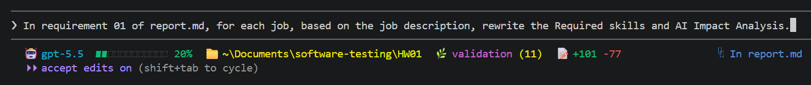
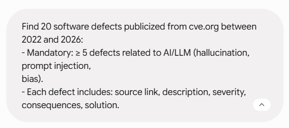
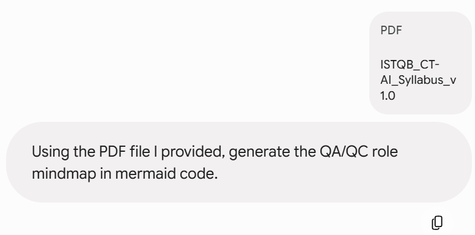

# HW01 — Prompt Log Template

## 1. Requirement 1

> - Timestamp: 16:12 01/06/2026
> - Model: GPT-5.5
> - Prompt: "Read the requirements\2026.HW01.Jobs.Defects.PhysicalProduct_En.pdf, complete Requirement 1 - QA/QC Job Market 2026+ using chrome-devtools-mcp. Focus on LinkedIn first. After that, complete the Requirement 1 section in report.md, using templates\hw01-job-postings-template.md."


## 2. Copy exact job description and refortmat Requirement 1 section.

> - Timestamp: 22:58 02/06/2025
> - Model: GPT-5.4
> - Prompt: "In the Requirement 1 section of report.md, using chrome-devtools-mcp@latest, visit all the websites of the jobs to copy the full job description and put them into quotation (>). Reformat other jobs section to be similar as the posting 01."


## 3. Requirement 1: Rewrite skills + ai impact

> - Timestamp: 15:35 03/06/2026
> - Model: GPT-5.5
> - Prompt: "In requirement 01 of report.md, for each job, based on the job description, rewrite the Required skills and AI Impact Analysis."



## 4. 20 defects

> - Timestamp: 16:18 03/06/2026
> - Model: Gemini 3.1 Pro
> - Prompt: "Find 20 software defects publicized from cve.org between 2022 and 2026:
>   - Mandatory: ≥ 5 defects related to AI/LLM (hallucination, prompt injection, bias).
>    - Each defect includes: source link, description, severity, consequences, solution."



## 5. QA/QC role mindmap

> - Timestamp: 08:15 04/06/2026
> - Model: Gemini 3.1 Pro
> - Prompt: "Using the PDF file I provided, generate the QA/QC role mindmap in mermaid code."



## 6. Generate 15 testcases

> - Timestamp: 19:26 04/06/202
> - Model: GPT 5.5
> - Prompt: Below

```
Act as an expert QA/QC Test Engineer. I need to design test cases for a physical product for Requirement 3 section in report.md.

Product Specification:
- Product Type: Domestic Stand Fan (Model: LIFAN Đ-16RC-0)
- Control Interface: It has 5 electronic/soft buttons on the control panel:
  1. ON/OFF (1 single button to toggle power status)
  2. SPEED (Cycles through wind speeds: Low - Medium - High)
  3. TIMER (Increments time delay to turn off the fan automatically)
  4. SWING (Toggles horizontal oscillation on and off)
  5. MODE (Cycles through wind profiles: Normal, Natural, Sleep)

Task Requirements:
- Generate exactly 15 comprehensive test cases covering Functional, Usability, and Interoperability scenarios based on the interface above.
- Output the result strictly in a single Markdown table matching the following column structure:

| TC ID | Objective | Input / Pre-conditions | Execution Steps | Expected Result | Actual Result | Verdict |

Instructions for columns:
1. TC ID: Use numbering format starting from TC01 to TC15.
2. Actual Result: Leave this column completely empty (or put "[Pending Physical Execution]") so I can fill it out manually after testing the real device.
3. Verdict: Leave this column empty (or put "[Pending]").
4. Ensure all descriptions, steps, and expected results are written in technical English and highly precise for physical hardware testing.

Write them into report.md in the Requirement 3 section.   
```

