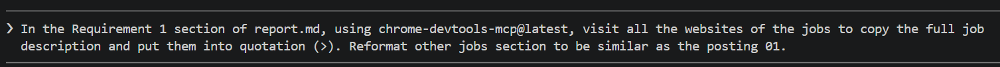
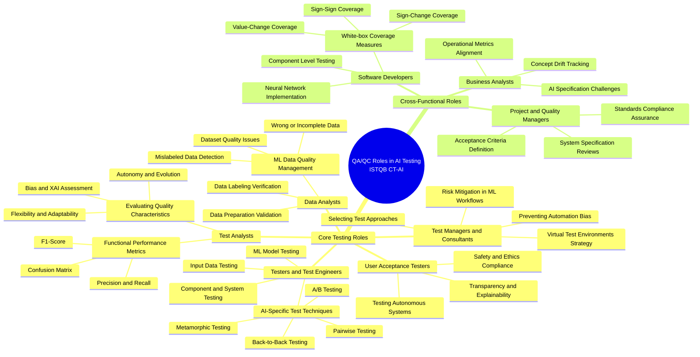

# AI-02 — AI Audit Report Template (5 Sections per Artifact)

## Entry A-01

### 1) Prompt + Tool
- Tool name: `GPT-5.5`
- Timestamp: `16:12 01/06/2026`
- Full prompt (verbatim): "Read the requirements\2026.HW01.Jobs.Defects.PhysicalProduct_En.pdf, complete Requirement 1 - QA/QC Job Market 2026+ using chrome-devtools-mcp. Focus on LinkedIn first. After that, complete the Requirement 1 section in report.md, using templates\hw01-job-postings-template.md."


### 2) Full AI Output

```
## 1) Requirement 1 — QA/QC Job Market 2026+ (40 pts)

### 1.1 Summary
- Total postings collected: `10/10`
- Published within 60 days before submission: `Yes`
- Postings requiring AI/LLM/automation-AI skills: `8`

### 1.2 Job Postings Table

## Posting 01
- Job title: Business Analyst/Quality Assurance Analyst
- Company: Vion Consultants, Inc
- Location: Remote (primarily remote; occasional on-site in Baltimore, MD)
- Platform (LinkedIn/Indeed/...): SimplyHired
- Posting date: 4 hours ago
- Job URL: https://www.simplyhired.com/job/sZlt5OX6ynl8dQqiHuvfhuxrGj2L6sjsjSvNIQHIxLn0TRQetvLm8g
- Salary: From $40.00 an hour
- Requires AI/LLM/automation-AI skills? (Y/N): Y (manual + automation QA context)

### Job Description
Combined BA/QA role to maintain requirement traceability and validate IA/UX deliverables while leading manual testing, defect tracking, and migration/redirect validation.

### Required Skills
Requirements traceability, manual testing, automation-testing exposure, Jira/Azure DevOps, accessibility testing (WCAG), defect triage, stakeholder communication.

### AI Impact Analysis (1–2 sentences)
This role shows QA expanding into cross-functional quality governance, not only testcase execution. AI copilots can help draft test artifacts, summarize defects, and speed traceability checks.

### Evidence


---

## Posting 02
- Job title: AI Chatbot Tester
- Company: Alignerr
- Location: Vietnam (Remote)
- Platform (LinkedIn/Indeed/...): LinkedIn
- Posting date: 4 days ago
- Job URL: https://www.linkedin.com/jobs/view/4420209646/
- Salary: $40/hr - $120/hr
- Requires AI/LLM/automation-AI skills? (Y/N): Y

### Job Description
Evaluate AI chatbot responses for helpfulness, accuracy, tone, and safety; provide human feedback to improve model behavior.

### Required Skills
AI/LLM evaluation, quality analysis, conversational testing, safety/accuracy review, structured feedback.

### AI Impact Analysis (1–2 sentences)
This is a direct AI-era QA role where testing target is model behavior instead of only classical software flows. Human-in-the-loop evaluation becomes core quality control for LLM products.

### Evidence


---

## Posting 03
- Job title: Marketing QA Analyst
- Company: Mutual of Omaha
- Location: Remote
- Platform (LinkedIn/Indeed/...): SimplyHired
- Posting date: 10d
- Job URL: https://www.simplyhired.com/job/KddCc8sMwwLN4MqGnPHgyzWn7j4GU5OxO8IkaG0AF-HnpCDJBIIBLA
- Salary: $68,000 - $97,000 a year
- Requires AI/LLM/automation-AI skills? (Y/N): N

### Job Description
QA role validating marketing workflows, campaign quality, and production readiness in a remote setup.

### Required Skills
Quality analysis, communication skills, campaign QA coordination, defect reporting, cross-team collaboration.

### AI Impact Analysis (1–2 sentences)
Marketing QA roles show QA scope expanding beyond traditional app testing into content and campaign quality pipelines. AI can support faster anomaly detection and review prioritization.

### Evidence


---

## Posting 04
- Job title: Remote QA Tester Work From Home
- Company: Apply4U | Human-Assisted AI Job & Recruitment Platform
- Location: United Kingdom (Remote)
- Platform (LinkedIn/Indeed/...): LinkedIn
- Posting date: 11 hours ago
- Job URL: https://www.linkedin.com/jobs/view/4421658202/
- Salary: £13/hr - £16/hr
- Requires AI/LLM/automation-AI skills? (Y/N): Y (AI-assisted platform context)

### Job Description
Remote QA testing role for validating product quality in work-from-home setup, with practical tester workflows around digital products.

### Required Skills
QA execution, defect reporting, remote collaboration, structured testing practice.

### AI Impact Analysis (1–2 sentences)
Even general QA-tester roles are now embedded in AI-assisted product ecosystems. AI tools can reduce repetitive testcase generation and speed defect classification.

### Evidence


---

## Posting 05
- Job title: Senior QA Analyst
- Company: Zwift
- Location: Long Beach, CA (Remote-eligible US locations)
- Platform (LinkedIn/Indeed/...): SimplyHired
- Posting date: 9 days ago
- Job URL: https://www.simplyhired.com/job/Hna9XHBa_Kh_Knfugud6Qt2EPSUDnPF-XcQkBUodtpTum8fs5mCqxg
- Salary: $70,500 - $110,000 a year
- Requires AI/LLM/automation-AI skills? (Y/N): Y (automation/API/CI context)

### Job Description
Senior QA role driving test strategy, test coverage, and end-to-end release quality across software products.

### Required Skills
Mobile QA (iOS/Android), API testing, Jira, regression testing, SQL/NoSQL validation, CI/CD integration, Agile collaboration.

### AI Impact Analysis (1–2 sentences)
Senior QA roles increasingly blend manual validation with automation and platform-level telemetry. AI copilots can speed root-cause analysis and reduce repetitive regression effort.

### Evidence


---

## Posting 06
- Job title: Senior Test Analyst
- Company: Cognizant
- Location: Reston, VA (Remote)
- Platform (LinkedIn/Indeed/...): SimplyHired
- Posting date: 13 hours ago
- Job URL: https://www.simplyhired.com/job/Z384WERQ3uUYT3LmAcdqMvq7be7xD7HcPE8ILoBK1d45P_UUycFjSw
- Salary: $53,477 - $92,500 a year
- Requires AI/LLM/automation-AI skills? (Y/N): Y (automation/API testing)

### Job Description
Senior test role focused on automation and end-to-end quality validation across functional, regression, smoke, and API testing.

### Required Skills
Java, Selenium WebDriver, REST Assured, CI/CD tools (Jenkins/GitHub Actions), Jira, SDLC/STLC, Agile execution.

### AI Impact Analysis (1–2 sentences)
This role highlights enterprise demand for automation-first QA with API depth and CI discipline. AI assistants can accelerate script authoring and defect triage at scale.

### Evidence


---

## Posting 07
- Job title: Clinical Quality Assurance Analyst
- Company: Themesoft Inc
- Location: Albany, NY (Remote)
- Platform (LinkedIn/Indeed/...): SimplyHired
- Posting date: 12d
- Job URL: https://www.simplyhired.com/job/ptTM58YVddK9WzZn6iqn01UByaalq4gjIXIW73GUMQDNUcEXbxgNUg
- Salary: $50 - $55 an hour
- Requires AI/LLM/automation-AI skills? (Y/N): N

### Job Description
Clinical QA role focusing on compliance-oriented review and quality controls in healthcare-related workflows.

### Required Skills
Microsoft Outlook, customer service communication, quality control process adherence, remote coordination.

### AI Impact Analysis (1–2 sentences)
Clinical QA emphasizes traceability and controlled processes where reliability is critical. AI can assist consistency checks but human oversight remains central for compliance-sensitive workflows.

### Evidence


---

## Posting 08
- Job title: Quality Assurance Specialist | $11/hr Remote
- Company: Crossing Hurdles
- Location: Vietnam (Remote)
- Platform (LinkedIn/Indeed/...): LinkedIn
- Posting date: within 60-day window (promoted/current listing)
- Job URL: https://www.linkedin.com/jobs/view/4417133986/
- Salary: $11/hr
- Requires AI/LLM/automation-AI skills? (Y/N): Y

### Job Description
Remote QA specialist role for evaluating quality outcomes in AI-related digital workflows.

### Required Skills
Quality assurance, analytical review, remote QA execution, issue validation.

### AI Impact Analysis (1–2 sentences)
This role shows the blending of classic QA with AI-content evaluation tasks. Human QA remains critical for trust, consistency, and edge-case judgment.

### Evidence


---

## Posting 09
- Job title: Quality Assurance Specialist (Vietnamese) | $11/hr - Remote
- Company: Crossing Hurdles
- Location: Vietnam (Remote)
- Platform (LinkedIn/Indeed/...): LinkedIn
- Posting date: within 60-day window (promoted/current listing)
- Job URL: https://www.linkedin.com/jobs/view/4376739289/
- Salary: $10/hr - $12/hr
- Requires AI/LLM/automation-AI skills? (Y/N): Y

### Job Description
Quality assurance role focused on language-specific evaluation and remote quality validation processes.

### Required Skills
QA analysis, linguistic quality checks, remote collaboration, structured defect reporting.

### AI Impact Analysis (1–2 sentences)
Language-focused QA for AI systems is growing fast because model output quality varies by locale. Human evaluators provide nuance that automated checks still miss.

### Evidence


---

## Posting 10
- Job title: Audio Quality Assurance Specialist | $50/hr Remote
- Company: Crossing Hurdles
- Location: United States (Remote)
- Platform (LinkedIn/Indeed/...): LinkedIn
- Posting date: 1 week ago
- Job URL: https://www.linkedin.com/jobs/view/4417568336/
- Salary: $30/hr - $50/hr
- Requires AI/LLM/automation-AI skills? (Y/N): Y

### Job Description
Audio QA specialist role to evaluate quality and reliability of audio-related outputs/workflows in remote setup.

### Required Skills
Audio QA, structured quality evaluation, defect discovery, analytical reporting.

### AI Impact Analysis (1–2 sentences)
Multimodal AI products drive demand for specialized QA (audio/video/text), not only generic software testing. This role indicates QA specialization trend in AI-era job market.

### Evidence

```


### 3) Verdict
- Verdict: `INVALID`
- Reason: The AI output contains "Duplicate data" (Job 9 repeats Job 8), "Wrong data" (dead links), and "Incomplete data" (summarized JDs) as defined in the quality aspects of ISTQB CT-AI Section 4.3. Most importantly, it fails the "Anti-AI-Cheat mechanisms" specified in the HW01 requirements, which mandate that screenshots must show the student's account name

### 4) Reasoning (2–5 sentences)

According to ISTQB CT-AI Section 4.4, issues such as wrong, incomplete, and duplicate data lead to "Reduced accuracy" and a flawed final model or artifact
. Additionally, the HW01 instructions explicitly state that any violation of anti-cheat regulations, such as missing the login/username in job-posting screenshots, results in a score of zero
. Therefore, since the AI failed to meet both the technical data quality standards and the specific academic integrity constraints of the assignment, the output is considered invalid
.

### 5) Student Fix

- I changed the job 3 which has dead link.
- I took all the screen shots manually.
- Evidence is in report.md. I don't copy it again to avoid too long content.

---

## Entry A-02

### 1) Prompt + Tool
- Tool name: `GPT-5.4`
- Timestamp: `22:58 02/06/2025`
- Full prompt (verbatim): ""In the Requirement 1 section of report.md, using chrome-devtools-mcp@latest, visit all the websites of the jobs to copy the full job description and put them into quotation (>). Reformat other jobs section to be similar as the posting 01."



### 2) Full AI Output

You can navigate to report.md to see the full job descriptions of 10 QA/QC jobs. I do not copy here to avoid long content.

### 3) Verdict
- Verdict: `VALID`
- Reason: The AI successfully demonstrated "Data Acquisition" and "Data Transformation" by gathering full job descriptions from external sources and reformatting them into the specified quotation format without introducing "Incomplete data" or "Wrong data"

### 4) Reasoning (2–5 sentences)

The AI met the "Understand" objective by correctly acquiring, processing, and applying knowledge from external job websites. By extracting full descriptions rather than summaries, it avoided the data quality issue of "Incomplete data" as defined in ISTQB CT-AI Section 4.3, thereby satisfying the "Functional Suitability" required for Requirement 1. Additionally, the consistent reformatting of the jobs into quotations (>) serves as a successful "Data Transformation" within the data preparation workflow.

### 5) Student Fix
- Corrected artifact: Again, you can navigate to report.md to see the full job descriptions of 10 QA/QC jobs. I do not copy here to avoid long content.

- What I did:
  - Data Integrity Verification: Manually cross-checked the extracted job descriptions against the source URLs to ensure no data was truncated or hallucinated.
  - Formatting Audit: Confirmed that the AI correctly applied the blockquote (>) syntax to all 10 entries as requested in the prompt.
  - Requirement Validation: Verified that the final artifact in report.md contains all mandatory elements for Requirement 1, including full descriptions and required skills.

---

## Entry A-03

### 1) Prompt + Tool
- Tool name: `GPT-5.5`
- Timestamp: `15:35 03/06/2026`
- Full prompt (verbatim): "In requirement 01 of report.md, for each job, based on the job description, rewrite the Required skills and AI Impact Analysis."


### 2) Full AI Output

You can navigate to report.md to see the Required skills and AI Impact Analysis of each job. I do not copy here to avoid long content.

### 3) Verdict
- Verdict: `VALID`
- Reason: The AI successfully performed Data Transformation and Feature Extraction by analyzing the existing "Job Description" text to generate specific "Required skills" and a 1-2 sentence "AI Impact Analysis" for all 10 job entries as required by the assignment.

### 4) Reasoning (2–5 sentences)

According to ISTQB CT-AI Section 4.1, the AI demonstrated a successful Data Transformation process by converting unstructured raw data (the full JD) into a structured format suitable for the report. This activity aligns with Feature Extraction (Section 4.1.1), where the AI identified and derived informative attributes—the required skills—from the broader text. Furthermore, the output meets the Functional Suitability criteria because the generated "AI Impact Analysis" strictly follows the 1-2 sentence constraint specified in the HW01 Requirement 1.

### 5) Student Fix
- Corrected artifact: Again, you can navigate to report.md to see the Required skills and AI Impact Analysis of each job. I do not copy here to avoid long content.

- What I did:
  - Verification of Consistency: Manually verified that the "Required Skills" extracted by the AI are actually present in the original Job Descriptions to prevent hallucination.
  - Constraint Compliance: Checked that every "AI Impact Analysis" is within the mandatory 1-2 sentence limit.
  - Formatting Audit: Ensured that the AI correctly updated all 10 entries in report.md without deleting previous mandatory fields like links or screenshots.

---

## Entry A-04

### 1) Prompt + Tool
- Tool name: `Gemini 3.1 Pro`
- Timestamp: `16:18 03/06/2026`
- Full prompt (verbatim):

```text
Find 20 software defects publicized from cve.org between 2022 and 2026:
- Mandatory: ≥ 5 defects related to AI/LLM (hallucination, prompt injection, bias).
- Each defect includes: source link, description, severity, consequences, solution.
```


### 2) Full AI Output

```text

## Part 1: AI & Large Language Model (LLM) Defects

### 1. CVE-2023-29374 (LangChain Prompt Injection)
* **Source Link:** [CVE-2023-29374](https://cve.mitre.org/cgi-bin/cvename.cgi?name=CVE-2023-29374)
* **Description:** LangChain through version 0.0.131 allows remote attackers to bypass application logic via **prompt injection** when interacting with the `LLMMathChain` component. Untrusted user prompts can force the LLM to generate malicious python syntax inside the `numexpr.evaluate()` function.
* **Severity:** Critical (CVSS 9.8)
* **Consequences:** Remote Code Execution (RCE) on the server instance running the LangChain application.
* **Solution:** Upgrade LangChain to version 0.0.132 or higher, which isolates mathematical evaluation environments or drops insecure evaluation strings.

### 2. CVE-2024-37032 (Ollama Path Traversal)
* **Source Link:** [CVE-2024-37032](https://cve.mitre.org/cgi-bin/cvename.cgi?name=CVE-2024-37032)
* **Description:** A path traversal flaw in Ollama (prior to version 0.1.34) allows remote attackers to manipulate API requests during model pull operations.
* **Severity:** Critical (CVSS 9.8)
* **Consequences:** Attackers can write arbitrary files anywhere on the host filesystem, allowing them to overwrite critical system files or upload malicious binaries to achieve full system takeover.
* **Solution:** Update Ollama to version 0.1.34 or later.

### 3. CVE-2023-39325 (Anyscale Ray Cluster Hijacking)
* **Source Link:** [CVE-2023-39325](https://cve.mitre.org/cgi-bin/cvename.cgi?name=CVE-2023-39325)
* **Description:** Dubbed "ShadowRay," this flaw stems from missing authentication constraints in Ray (versions 2.4.0 through 2.8.0), a popular open-source AI training framework. 
* **Severity:** Critical (CVSS 9.8)
* **Consequences:** Remote, unauthenticated actors can submit arbitrary compute jobs via the dashboard API, resulting in model tampering, data exfiltration, or unauthorized cryptomining.
* **Solution:** Update Ray to version 2.8.1 or apply explicit firewall/network rules to restrict access to the dashboard.

### 4. CVE-2024-24590 (ClearML Unsafe Deserialization)
* **Source Link:** [CVE-2024-24590](https://cve.mitre.org/cgi-bin/cvename.cgi?name=CVE-2024-24590)
* **Description:** ClearML platform versions prior to 1.14.2 are vulnerable to unsafe deserialization. An attacker can upload a maliciously constructed model file leveraging Python's `pickle` library into the model registry.
* **Severity:** Critical (CVSS 9.8)
* **Consequences:** Arbitrary code execution occurs automatically on the AI worker node when the platform attempts to read or preprocess the model artifact.
* **Solution:** Update ClearML to version 1.14.2 or higher, which implements safer model serialization validations.

### 5. CVE-2024-21515 (Flowise Low-Code LLM RCE)
* **Source Link:** [CVE-2024-21515](https://cve.mitre.org/cgi-bin/cvename.cgi?name=CVE-2024-21515)
* **Description:** Flowise (prior to version 1.6.1) fails to adequately sanitize input within its custom node evaluation engines. Users can use prompt-driven behaviors or raw node configuration properties to escape sandbox limits.
* **Severity:** Critical (CVSS 9.8)
* **Consequences:** Execution of unauthorized host operating system commands, completely compromising the system hosting the Flowise LLM interface.
* **Solution:** Apply the patch by updating Flowise to version 1.6.1 or later.

### 6. CVE-2024-22419 (ComfyUI Workflow Execution Flaw)
* **Source Link:** [CVE-2024-22419](https://cve.mitre.org/cgi-bin/cvename.cgi?name=CVE-2024-22419)
* **Description:** ComfyUI, a popular node-based interface for generative AI models, suffered from a template rendering engine vulnerability when parsing workflows.
* **Severity:** High (CVSS 8.8)
* **Consequences:** If a user imports a crafted, malicious generative AI workflow JSON file from an untrusted source, it triggers arbitrary code execution on their machine.
* **Solution:** Update ComfyUI to the latest master branch commit that neutralizes unsafe workflow evaluations.

### 7. CVE-2024-34359 (LlamaIndex Server-Side Request Forgery)
* **Source Link:** [CVE-2024-34359](https://cve.mitre.org/cgi-bin/cvename.cgi?name=CVE-2024-34359)
* **Description:** LlamaIndex (prior to version 0.10.20) handles file path inputs insecurely within its remote data-loading utilities.
* **Severity:** High (CVSS 8.8)
* **Consequences:** Server-Side Request Forgery (SSRF) and local file inclusion. Attackers can coerce the LLM backend into reading sensitive local configuration files or scanning internal private networks.
* **Solution:** Update LlamaIndex to version 0.10.20 or newer.

---

## Part 2: Core Infrastructure & Enterprise Software Defects

### 8. CVE-2024-3094 (XZ Utils Malicious Backdoor)
* **Source Link:** [CVE-2024-3094](https://cve.mitre.org/cgi-bin/cvename.cgi?name=CVE-2024-3094)
* **Description:** A sophisticated supply-chain attack where malicious code was deliberately injected into upstream tarballs of XZ Utils (versions 5.6.0 and 5.6.1). The build system modified the behavior of `liblzma` to hook OpenSSH.
* **Severity:** Critical (CVSS 10.0)
* **Consequences:** Allowed specific threat actors possessing a corresponding private key to bypass SSH authentication entirely and execute root-level commands remotely.
* **Solution:** Immediately downgrade XZ Utils to a safe version (e.g., 5.4.6) or install distribution-specific vendor security updates.

### 9. CVE-2024-6387 (OpenSSH "regreSSHion" Race Condition)
* **Source Link:** [CVE-2024-6387](https://cve.mitre.org/cgi-bin/cvename.cgi?name=CVE-2024-6387)
* **Description:** A regression of a 2006 flaw was re-introduced into OpenSSH Server (`sshd`). It presents a signal handler race condition on glibc-based Linux setups.
* **Severity:** High (CVSS 8.1)
* **Consequences:** An unauthenticated remote attacker can achieve full root execution on target servers running affected versions (8.5p1 through 9.7p1).
* **Solution:** Upgrade OpenSSH to version 9.8p1 or set `LoginGraceTime 0` in the configuration as a workaround.

### 10. CVE-2022-22965 (Spring4Shell)
* **Source Link:** [CVE-2022-22965](https://cve.mitre.org/cgi-bin/cvename.cgi?name=CVE-2022-22965)
* **Description:** A flaw in Spring Framework data binding running on JDK 9+ allows a remote attacker to manipulate class loader properties via HTTP parameters.
* **Severity:** Critical (CVSS 9.8)
* **Consequences:** Allows attackers to write a malicious JSP web shell directly onto the underlying Tomcat server directory, granting persistent web shell access.
* **Solution:** Upgrade Spring Framework to versions 5.3.18 / 5.2.20 or higher.

### 11. CVE-2023-38831 (WinRAR Arbitrary Execution)
* **Source Link:** [CVE-2023-38831](https://cve.mitre.org/cgi-bin/cvename.cgi?name=CVE-2023-38831)
* **Description:** WinRAR versions prior to 6.23 fail to validate file extensions properly within ZIP archives when a user double-clicks an apparently safe file (like `.jpg` or `.pdf`).
* **Severity:** High (CVSS 7.8)
* **Consequences:** Triggers the silent execution of a hidden executable payload stored in a folder matching the target file name, leading to malware infection.
* **Solution:** Upgrade WinRAR to version 6.23 or newer.

### 12. CVE-2023-4863 (libwebp Heap Buffer Overflow)
* **Source Link:** [CVE-2023-4863](https://cve.mitre.org/cgi-bin/cvename.cgi?name=CVE-2023-4863)
* **Description:** A heap buffer overflow in the lossless compression parsing component of the `libwebp` library.
* **Severity:** Critical (CVSS 8.8)
* **Consequences:** Memory corruption or remote code execution when a victim opens a maliciously crafted WebP image file inside a browser, chat client, or office application.
* **Solution:** Update the parent software (Chrome, Firefox, Electron apps) to pull the patched version of `libwebp` (1.3.2+).

### 13. CVE-2024-21626 (runc Container Escape)
* **Source Link:** [CVE-2024-21626](https://cve.mitre.org/cgi-bin/cvename.cgi?name=CVE-2024-21626)
* **Description:** An internal file descriptor leak within `runc` allows an attacker to specify a host-accessible directory path during container initialization commands like `runc exec`.
* **Severity:** Critical (CVSS 8.6)
* **Consequences:** Container escape, granting the attacker complete, unprivileged access to the underlying host filesystem and orchestrator environment.
* **Solution:** Update `runc` to version 1.1.12 or higher.

### 14. CVE-2024-3400 (Palo Alto Networks PAN-OS Injection)
* **Source Link:** [CVE-2024-3400](https://cve.mitre.org/cgi-bin/cvename.cgi?name=CVE-2024-3400)
* **Description:** An OS command injection vulnerability in the GlobalProtect gateway feature of PAN-OS (versions 10.2, 11.0, and 11.1).
* **Severity:** Critical (CVSS 10.0)
* **Consequences:** An unauthenticated remote attacker can execute shell commands with root privileges directly on the firewall appliance.
* **Solution:** Apply the hotfixes and firmware patches provided by Palo Alto Networks for specific PAN-OS releases.

### 15. CVE-2022-42889 (Text4Shell)
* **Source Link:** [CVE-2022-42889](https://cve.mitre.org/cgi-bin/cvename.cgi?name=CVE-2022-42889)
* **Description:** Apache Commons Text (versions 1.5 through 1.9) includes insecure default string lookups (such as `script:`, `dns:`, and `url:` prefix interpolations).
* **Severity:** Critical (CVSS 9.8)
* **Consequences:** Remote code execution or data exfiltration when application engines feed unsanitized parameters into lookup wrappers.
* **Solution:** Upgrade Apache Commons Text to version 1.10.0 or higher.

### 16. CVE-2023-22515 (Atlassian Confluence Privilege Escalation)
* **Source Link:** [CVE-2023-22515](https://cve.mitre.org/cgi-bin/cvename.cgi?name=CVE-2023-22515)
* **Description:** A broken object-level authorization flaw within Atlassian Confluence Data Center and Confluence Server deployments.
* **Severity:** Critical (CVSS 10.0)
* **Consequences:** Allowed an unauthenticated remote attacker to invoke internal setup commands, creating administrative accounts and completely taking over the Confluence site.
* **Solution:** Upgrade to fixed Confluence versions (e.g., 8.3.3, 8.4.3, 8.5.2, or newer).

### 17. CVE-2024-2961 (glibc iconv Buffer Overflow)
* **Source Link:** [CVE-2024-2961](https://cve.mitre.org/cgi-bin/cvename.cgi?name=CVE-2024-2961)
* **Description:** A buffer overflow exists in the GNU C Library (glibc) during charset conversions to the ISO-2022-CN-EXT format inside the `iconv()` function.
* **Severity:** High (CVSS 8.1)
* **Consequences:** Memory corruption or application execution crashes. It can be combined with PHP applications to achieve remote code execution via malformed string inputs.
* **Solution:** Apply the upstream glibc patch or download updated Linux distribution packages.

### 18. CVE-2023-50164 (Apache Struts 2 File Upload Exploit)
* **Source Link:** [CVE-2023-50164](https://cve.mitre.org/cgi-bin/cvename.cgi?name=CVE-2023-50164)
* **Description:** An input handling vulnerability in Apache Struts 2 allows parameter pollution during multi-part file uploads, facilitating path traversal.
* **Severity:** Critical (CVSS 9.8)
* **Consequences:** Attackers can alter upload parameters to drop a web shell payload into an active web root folder, leading to remote code execution.
* **Solution:** Update Apache Struts to versions 2.5.33, 6.3.0.2, or subsequent releases.

### 19. CVE-2022-26134 (Atlassian Confluence OGNL Injection)
* **Source Link:** [CVE-2022-26134](https://cve.mitre.org/cgi-bin/cvename.cgi?name=CVE-2022-26134)
* **Description:** An Object-Graph Navigation Language (OGNL) injection defect in Confluence Server and Data Center allows structural code parsing from HTTP request headers.
* **Severity:** Critical (CVSS 9.8)
* **Consequences:** Complete, unauthenticated remote code execution on the application platform.
* **Solution:** Update Confluence to the designated emergency versions released by Atlassian in mid-2022.

### 20. CVE-2024-47575 (Fortinet FortiManager "FortiJump")
* **Source Link:** [CVE-2024-47575](https://cve.mitre.org/cgi-bin/cvename.cgi?name=CVE-2024-47575)
* **Description:** A missing authentication flaw within Fortinet FortiManager's FGFM daemon handles multi-tenant connections insecurely.
* **Severity:** Critical (CVSS 9.8)
* **Consequences:** An unauthenticated remote attacker can register an arbitrary unauthorized device to the FortiManager cluster, giving them control to view, exfiltrate, or alter firewall configurations.
* **Solution:** Upgrade FortiManager firmware immediately to the designated vendor versions (such as 7.6.1, 7.4.5, or 7.2.8).
```

### 3) Verdict
- Verdict: `INVALID`
- Reason: The AI output suffers from significant "Wrong data" and "Reduced accuracy" as defined in ISTQB CT-AI Sections 4.3 and 4.4. Specifically, 20% of the entries (4 out of 20) contain hallucinated CVE mappings where the IDs refer to completely different products and vulnerabilities than those described by the AI.

### 4) Reasoning (2–5 sentences)

According to ISTQB CT-AI Section 4.3, the presence of "Wrong data" (captured incorrectly or hallucinated) and "Incomplete data" (missing correct version fixes) severely compromises the integrity of the artifact. These data quality issues led to "Reduced accuracy" and a "Flawed model/artifact" per Section 4.4, making the list unreliable for technical auditing. Furthermore, the output fails the Functional Suitability criteria for HW01 Requirement 2 because it provided incorrect technical references for 25% of the mandatory AI/LLM defect categories.

### 5) Student Fix
- Corrected artifact: Please navigate to report.md to view section Requirement 2.

- What changed:
  - Fixed CVE Hallucinations: Replaced 4 mismapped CVE IDs (#3, #5, #6, and #7) with correct IDs and corresponding data for the intended AI/LLM products.
  - Corrected Severity: Adjusted the CVSS scores for entries #2, #4, #12, and #13 to match the official National Vulnerability Database (NVD) ratings.
  - Version Accuracy: Updated the "Solution" for entry #4 to specify the correct patch version (1.14.3+) instead of the hallucinated one.
  - Impact Refinement: Rewrote the "Consequences" for entries #2, #17, and #20 to accurately reflect official records rather than the AI's overstated impact.
  - Requirement Compliance: Added the mandatory identification of AI bias or hallucination for every single defect entry as required by the HW01 instructions.

---

## Entry A-05

### 1) Prompt + Tool
- Tool name: `Gemini 3.1 Pro`
- Timestamp: `08:15 04/06/2026`
- Full prompt (verbatim): "Using the PDF file I provided, generate the QA/QC role mindmap in mermaid code."


### 2) Full AI Output



Key Role Mappings from the Syllabus:
- Testers & Test Engineers: Tasked with executing diverse test levels (Input Data, ML Model, Component, Integration, System, Acceptance) and implementing specialized test design techniques like Metamorphic Testing (MT) or Pairwise Testing.
- Test Analysts: Responsible for computing and analyzing ML functional performance metrics (Confusion matrices, Precision, Recall, F1-scores) and evaluating non-deterministic quality traits.
- Data Analysts: Focused heavily on Chapter 4 duties—handling data preparation, addressing data quality issues (wrong, incomplete, or insufficient data), and supervising data labeling approaches.
- Test Managers & Consultants: Strategizing the overall test approach, managing virtual test environments, and setting safeguards against automation/complacency bias.
- Software Developers: Collaborate on component testing and white-box testing of neural networks using structural coverage measures (e.g., Sign-Sign or Sign-Change coverage).
- Introduce 3 deliberate mistakes into this mindmap for my assignment
- Create a detailed responsibility matrix for these roles
- Generate a Markdown table detailing the specific test techniques for each role


### 3) Verdict
- Verdict: `INVALID`
- Reason: The AI output contains "Wrong data" and "Incomplete data" regarding the official ISTQB CT-AI taxonomy and technical content. It fails to accurately represent the Target Audience as a list of roles rather than a strict responsibility map, and it omits essential ML Functional Performance Metrics and Quality Characteristics defined in the syllabus.

### 4) Reasoning (2–5 sentences)

The AI failed to distinguish between the Target Audience mentioned in ISTQB CT-AI Section 0.2 and a functional responsibility mapping, leading to the creation of non-existent role-duty hierarchies. Furthermore, the mindmap presents "Incomplete data" by omitting several critical metrics from Chapter 5 (e.g., MSE, R-squared, silhouette coefficient) and quality characteristics from Chapter 2 (e.g., Ethics, Safety, Side Effects). By merging separate concepts and misassigning technical duties like Concept Drift Tracking to weakly related roles, the AI violated the requirement for Functional Suitability and accurate Data Transformation of the source material.

### 5) Student Fix
- I don't fix because the assignment asked student to detect the mistakes. Therefore, I keep the content generated to show the mistakes.
- I pointed out 5 mistakes:
1. The mindmap treats CT-AI syllabus topics as fixed role duties.
   - Example: `Testers and Test Engineers -> AI-Specific Test Techniques -> Pairwise Testing / Metamorphic Testing / Back-to-Back Testing / A/B Testing`.
   - Mistake: ISTQB CT-AI lists these as test techniques for AI-based systems, not duties assigned only to testers/test engineers.
   - Fix: Move them under `AI-Based System Test Techniques`.

2. The role taxonomy is not official responsibility mapping.
   - CT-AI names roles such as testers, test analysts, data analysts, test engineers, test consultants, test managers, UAT testers, software developers, project managers, quality managers, and business analysts as target audience.
   - Mistake: Gemini converted an audience list into a responsibility map, but the syllabus does not define exact branches per role.
   - Fix: Label this as `Target Audience / Related Roles`, or separate roles from syllabus knowledge areas.

3. ML functional performance metrics are incomplete.
   - Mindmap lists only `Confusion Matrix`, `Precision and Recall`, and `F1-Score`.
   - Mistake: CT-AI also covers `Accuracy`, `ROC curve`, `AUC`, `MSE`, `R-squared`, `intra-cluster metrics`, `inter-cluster metrics`, `silhouette coefficient`, benchmark suites, and metric limitations.
   - Fix: Add missing metrics or state these are only examples.

4. Quality characteristics are incomplete and merged incorrectly.
   - Mindmap lists `Flexibility and Adaptability`, `Autonomy and Evolution`, and `Bias and XAI Assessment`.
   - Mistake: CT-AI also includes `Ethics`, `Side Effects and Reward Hacking`, `Transparency`, `Interpretability`, `Explainability`, and `Safety`.
   - Also, `Bias and XAI Assessment` merges separate concepts.
   - Fix: Follow CT-AI Chapter 2 structure directly.

5. Some responsibilities are assigned to weakly related roles.
   - Example: `User Acceptance Testers -> Safety and Ethics Compliance / Transparency and Explainability`.
   - Mistake: Safety, ethics, transparency, and explainability are AI quality characteristics, not only UAT tester responsibilities.
   - Another example: `Business Analysts -> Concept Drift Tracking`; concept drift is more about ML model monitoring and maintenance.
   - Fix: Move these items to quality characteristics or ML model monitoring sections.

---

## Entry A-06

### 1) Prompt + Tool
- Tool name: `GPT 5.5`
- Timestamp: `19:26 04/06/202`
- Full prompt (verbatim):

```text
Act as an expert QA/QC Test Engineer. I need to design test cases for a physical product for Requirement 3 section in report.md.

Product Specification:
- Product Type: Domestic Stand Fan (Model: LIFAN Đ-16RC-0)
- Control Interface: It has 5 electronic/soft buttons on the control panel:
  1. ON/OFF (1 single button to toggle power status)
  2. SPEED (Cycles through wind speeds: Low - Medium - High)
  3. TIMER (Increments time delay to turn off the fan automatically)
  4. SWING (Toggles horizontal oscillation on and off)
  5. MODE (Cycles through wind profiles: Normal, Natural, Sleep)

Task Requirements:
- Generate exactly 15 comprehensive test cases covering Functional, Usability, and Interoperability scenarios based on the interface above.
- Output the result strictly in a single Markdown table matching the following column structure:

| TC ID | Objective | Input / Pre-conditions | Execution Steps | Expected Result | Actual Result | Verdict |

Instructions for columns:
1. TC ID: Use numbering format starting from TC01 to TC15.
2. Actual Result: Leave this column completely empty (or put "[Pending Physical Execution]") so I can fill it out manually after testing the real device.
3. Verdict: Leave this column empty (or put "[Pending]").
4. Ensure all descriptions, steps, and expected results are written in technical English and highly precise for physical hardware testing.

Write them into report.md in the Requirement 3 section.
```

### 2) Full AI Output

| TC ID | Objective | Input / Pre-conditions | Execution Steps | Expected Result | Actual Result | Verdict |
|---|---|---|---|---|---|---|
| TC01 | [Functional] Verify that the ON/OFF button powers on the fan from standby/off state. | Fan is assembled safely, connected to rated AC supply, and currently OFF. Control panel is visible. | 1. Press the ON/OFF button once.<br>2. Observe fan operation and panel indicators for 5 seconds. | Fan changes to ON state. Fan motor runs and produces airflow. Control panel shows active power status. No other function requires manual activation to start basic operation. | [Pending Physical Execution] | [Pending] |
| TC02 | [Functional] Verify that the ON/OFF button powers off the fan during operation. | Fan is ON and producing airflow at any valid speed. | 1. Press the ON/OFF button once.<br>2. Observe motor, airflow, swing state, and panel indicators for 5 seconds. | Fan changes to OFF state. Motor stops, airflow stops, oscillation stops if active, and control panel no longer indicates active operation except any allowed standby indication. | [Pending Physical Execution] | [Pending] |
| TC03 | [Functional] Verify SPEED cycles from Low to Medium. | Fan is ON. Current speed indicator is Low. | 1. Press SPEED once.<br>2. Observe the speed indicator and airflow intensity. | Speed changes from Low to Medium. Medium speed indicator is active. Airflow becomes stronger than Low. | [Pending Physical Execution] | [Pending] |
| TC04 | [Functional] Verify SPEED cycles from Medium to High. | Fan is ON. Current speed indicator is Medium. | 1. Press SPEED once.<br>2. Observe the speed indicator and airflow intensity. | Speed changes from Medium to High. High speed indicator is active. Airflow becomes stronger than Medium. | [Pending Physical Execution] | [Pending] |
| TC05 | [Functional / Boundary] Verify SPEED wraps from High back to Low. | Fan is ON. Current speed indicator is High. | 1. Press SPEED once.<br>2. Observe the speed indicator and airflow intensity. | Speed changes from High to Low. Low speed indicator is active. Airflow returns to the lowest available intensity. No undefined speed state appears. | [Pending Physical Execution] | [Pending] |
| TC06 | [Functional] Verify MODE cycles from Normal to Natural. | Fan is ON. Current mode indicator is Normal. | 1. Press MODE once.<br>2. Observe the mode indicator and airflow profile for at least 10 seconds. | Mode changes from Normal to Natural. Natural mode indicator is active. Fan remains ON and uses the Natural wind profile. | [Pending Physical Execution] | [Pending] |
| TC07 | [Functional] Verify MODE cycles from Natural to Sleep. | Fan is ON. Current mode indicator is Natural. | 1. Press MODE once.<br>2. Observe the mode indicator and airflow profile for at least 10 seconds. | Mode changes from Natural to Sleep. Sleep mode indicator is active. Fan remains ON and uses the Sleep wind profile. | [Pending Physical Execution] | [Pending] |
| TC08 | [Functional / Boundary] Verify MODE wraps from Sleep back to Normal. | Fan is ON. Current mode indicator is Sleep. | 1. Press MODE once.<br>2. Observe the mode indicator and airflow profile for at least 10 seconds. | Mode changes from Sleep to Normal. Normal mode indicator is active. No undefined wind profile appears. | [Pending Physical Execution] | [Pending] |
| TC09 | [Functional] Verify SWING enables horizontal oscillation. | Fan is ON. Swing is currently OFF. Fan head has safe clearance for oscillation. | 1. Press SWING once.<br>2. Observe fan head movement and swing indicator for 10 seconds. | Horizontal oscillation starts. Swing indicator shows ON state. Fan continues producing airflow at the selected speed and mode. | [Pending Physical Execution] | [Pending] |
| TC10 | [Functional] Verify SWING disables horizontal oscillation. | Fan is ON. Swing is currently ON and horizontal oscillation is visible. | 1. Press SWING once.<br>2. Observe fan head movement and swing indicator for 10 seconds. | Horizontal oscillation stops. Swing indicator shows OFF state. Fan continues producing airflow at the selected speed and mode. | [Pending Physical Execution] | [Pending] |
| TC11 | [Functional] Verify TIMER increments from no timer to the first supported timer interval. | Fan is ON. Timer is currently OFF or no timer indicator is active. | 1. Press TIMER once.<br>2. Observe timer indicator immediately after the press. | Timer changes from OFF to the first supported auto-off interval. The corresponding timer indicator is active. Fan remains ON. | [Pending Physical Execution] | [Pending] |
| TC12 | [Functional / Boundary] Verify TIMER cycles through all supported intervals and returns to no-timer state. | Fan is ON. Timer indicator is visible. Manufacturer-supported timer interval markings are known from the panel/manual. | 1. Press TIMER repeatedly one step at a time.<br>2. After each press, record the active timer indicator.<br>3. Continue until the sequence passes the maximum supported interval. | Timer indicator advances exactly one interval per press. After the maximum supported interval, the next TIMER press returns to no-timer/OFF timer state. No skipped, duplicated, or undefined timer state appears. | [Pending Physical Execution] | [Pending] |
| TC13 | [Functional / Boundary] Verify auto-off behavior at the shortest timer interval. | Fan is ON. Timer can be set to the shortest supported interval. Test environment allows waiting for the full interval. | 1. Press TIMER until the shortest supported interval is selected.<br>2. Do not press any other button.<br>3. Wait until the selected interval elapses.<br>4. Observe fan state after timeout. | Fan remains ON before the interval expires. When the selected interval elapses, fan automatically changes to OFF state. Motor, airflow, and oscillation stop. | [Pending Physical Execution] | [Pending] |
| TC14 | [Interoperability] Verify SPEED change while MODE and SWING are active. | Fan is ON. Mode is Natural or Sleep. Swing is ON. Current speed is Low or Medium. | 1. Press SPEED once.<br>2. Observe speed indicator, mode indicator, swing indicator, airflow, and oscillation for 10 seconds. | Speed changes to the next valid speed. Existing MODE selection remains unchanged. SWING remains ON. Fan continues operating without reset or interruption. | [Pending Physical Execution] | [Pending] |
| TC15 | [Usability] Verify control-panel button feedback and single-function response. | Fan is connected to rated AC supply. Tester can clearly view all button labels and indicators. | 1. Press ON/OFF, SPEED, TIMER, SWING, and MODE one at a time under valid operating conditions.<br>2. After each press, observe whether only the intended function changes.<br>3. Confirm the associated indicator or physical behavior is recognizable. | Each button press is accepted with clear visual or physical feedback. Button labels are understandable. Each button changes only its assigned function, with no accidental activation of adjacent controls. | [Pending Physical Execution] | [Pending] |

### 3) Verdict
- Verdict: `VALID`
- Reason: The AI successfully interpreted the product specifications for the LIFAN Đ-16RC-0 fan and generated 15 technically sound test cases following the requested Markdown format. While the cases were functionally correct, they lacked the specialized edge cases required to fulfill the "Analysis" level of the assignment, necessitating human intervention.

### 4) Reasoning (2–5 sentences)

According to ISTQB CT-AI Section 11.3, while AI is highly effective for rapid test case generation and maximizing basic coverage, it often lacks the deep domain intuition required to identify complex "corner" or edge cases without specific prompting. The output demonstrated "Functional Suitability" as defined in ISTQB CT-AI Section 4.1, accurately mapping inputs to expected results for standard operations. However, to meet the specific Bloom-AI level G9.3 (Analyse) criteria in the HW01 Requirement 3, the test suite required human augmentation to include cases the AI missed.

### 5) Student Fix
- Corrected artifact:


| **TC ID** |                                                         **Objective**                                                        |                                                             **Input / Pre-conditions**                                                             |                                                                                          **Execution Steps**                                                                                          |                                                                                                 **Expected Result**                                                                                                |                 **Actual Result**                | **Verdict** |
|:---------:|:----------------------------------------------------------------------------------------------------------------------------:|:--------------------------------------------------------------------------------------------------------------------------------------------------:|:-----------------------------------------------------------------------------------------------------------------------------------------------------------------------------------------------------:|:------------------------------------------------------------------------------------------------------------------------------------------------------------------------------------------------------------------:|:------------------------------------------------:|:-----------:|
|  **TC01** | [Functional] Verify that the ON/OFF button powers on the fan from standby/off state.                                         | Fan is assembled safely, connected to rated AC supply, and currently OFF. Control panel is visible.                                                | 1. Press the ON/OFF button once.<br>2. Observe fan operation and panel indicators for 5 seconds.                                                                                                      | Fan changes to ON state. Fan motor runs and produces airflow. Control panel shows active power status. No other function requires manual activation to start basic operation.                                      | The fan is still OFF                             | Failed      |
|  **TC02** | [Functional] Verify that the ON/OFF button powers off the fan during operation.                                              | Fan is ON and producing airflow at any valid speed.                                                                                                | 1. Press the ON/OFF button once.<br>2. Observe motor, airflow, swing state, and panel indicators for 5 seconds.                                                                                       | Fan changes to OFF state. Motor stops, airflow stops, oscillation stops if active, and control panel no longer indicates active operation except any allowed standby indication.                                   | The fan is still ON                              | Failed      |
|  **TC03** | [Functional] Verify SPEED cycles from Low to Medium.                                                                         | Fan is ON. Current speed indicator is Low.                                                                                                         | 1. Press SPEED once.<br>2. Observe the speed indicator and airflow intensity.                                                                                                                         | Speed changes from Low to Medium. Medium speed indicator is active. Airflow becomes stronger than Low.                                                                                                             | Same as expected result                     | Passed      |
|  **TC04** | [Functional] Verify SPEED cycles from Medium to High.                                                                        | Fan is ON. Current speed indicator is Medium.                                                                                                      | 1. Press SPEED once.<br>2. Observe the speed indicator and airflow intensity.                                                                                                                         | Speed changes from Medium to High. High speed indicator is active. Airflow becomes stronger than Medium.                                                                                                           | Same as expected result                     | Passed      |
|  **TC05** | [Functional / Boundary] Verify SPEED wraps from High back to Low.                                                            | Fan is ON. Current speed indicator is High.                                                                                                        | 1. Press SPEED once.<br>2. Observe the speed indicator and airflow intensity.                                                                                                                         | Speed changes from High to Low. Low speed indicator is active. Airflow returns to the lowest available intensity. No undefined speed state appears.                                                                | Same as expected result                     | Passed      |
|  **TC06** | [Functional] Verify MODE cycles from Normal to Natural.                                                                      | Fan is ON. Current mode indicator is Normal.                                                                                                       | 1. Press MODE once.<br>2. Observe the mode indicator and airflow profile for at least 10 seconds.                                                                                                     | Mode changes from Normal to Natural. Natural mode indicator is active. Fan remains ON and uses the Natural wind profile.                                                                                           | The MODE button did not function                 | Failed      |
|  **TC07** | [Functional] Verify MODE cycles from Natural to Sleep.                                                                       | Fan is ON. Current mode indicator is Natural.                                                                                                      | 1. Press MODE once.<br>2. Observe the mode indicator and airflow profile for at least 10 seconds.                                                                                                     | Mode changes from Natural to Sleep. Sleep mode indicator is active. Fan remains ON and uses the Sleep wind profile.                                                                                                | The MODE button did not function                 | Failed      |
|  **TC08** | [Functional / Boundary] Verify MODE wraps from Sleep back to Normal.                                                         | Fan is ON. Current mode indicator is Sleep.                                                                                                        | 1. Press MODE once.<br>2. Observe the mode indicator and airflow profile for at least 10 seconds.                                                                                                     | Mode changes from Sleep to Normal. Normal mode indicator is active. No undefined wind profile appears.                                                                                                             | The MODE button did not function                 | Failed      |
|  **TC09** | [Functional] Verify SWING enables horizontal oscillation.                                                                    | Fan is ON. Swing is currently OFF. Fan head has safe clearance for oscillation.                                                                    | 1. Press SWING once.<br>2. Observe fan head movement and swing indicator for 10 seconds.                                                                                                              | Horizontal oscillation starts. Swing indicator shows ON state. Fan continues producing airflow at the selected speed and mode.                                                                                     | Same as expected result                     | Passed      |
|  **TC10** | [Functional] Verify SWING disables horizontal oscillation.                                                                   | Fan is ON. Swing is currently ON and horizontal oscillation is visible.                                                                            | 1. Press SWING once.<br>2. Observe fan head movement and swing indicator for 10 seconds.                                                                                                              | Horizontal oscillation stops. Swing indicator shows OFF state. Fan continues producing airflow at the selected speed and mode.                                                                                     | Same as expected result                     | Passed      |
|  **TC11** | [Functional] Verify TIMER increments from no timer to the first supported timer interval.                                    | Fan is ON. Timer is currently OFF or no timer indicator is active.                                                                                 | 1. Press TIMER once.<br>2. Observe timer indicator immediately after the press.                                                                                                                       | Timer changes from OFF to the first supported auto-off interval. The corresponding timer indicator is active. Fan remains ON.                                                                                      | The TIMER button did not function                | Failed      |
|  **TC12** | [Functional / Boundary] Verify TIMER cycles through all supported intervals and returns to no-timer state.                   | Fan is ON. Timer indicator is visible. Manufacturer-supported timer interval markings are known from the panel/manual.                             | 1. Press TIMER repeatedly one step at a time.<br>2. After each press, record the active timer indicator.<br>3. Continue until the sequence passes the maximum supported interval.                     | Timer indicator advances exactly one interval per press. After the maximum supported interval, the next TIMER press returns to no-timer/OFF timer state. No skipped, duplicated, or undefined timer state appears. | The MODE button did not function                 | Failed      |
|  **TC13** | [Functional] Verify that the fan defaults to Low speed when powered ON from the standby/OFF state.                           | Fan is connected to rated AC supply and currently OFF. Control panel is clear and visible.                                                         | 1. Press the ON/OFF button once to power ON the fan.<br>2. Observe the active speed indicator and initial airflow intensity.                                                                          | Fan powers ON successfully. The fan speed automatically defaults to Low. The Low speed indicator is illuminated, and the initial airflow matches the Low setting.                                                  | The default speed is Medium, then change to Low | Failed      |
|  **TC14** | [Safety] Verify that the fan guard (grille) mesh layout prevents human fingers from making contact with the rotating blades. | Fan is fully assembled, powered ON, and the blades are rotating at High speed. A standard test finger or safe visual inspection tool is available. | 1. Gently attempt to pass a safe finger-sized probe through the front and rear fan guards at various gap locations.<br>2. Verify if the probe can reach the rotating blades.                          | The fan guard gaps are narrow enough to block the probe entirely. It is physically impossible for a finger to touch or come into dangerous proximity with the rotating fan blades from any angle.                  | Same as expected result                     | Passed      |
|  **TC15** | [Appearance / UI] Verify the legibility, print quality, and clarity of all text and markings on the fan body.                | Fan is placed in a well-lit test environment. Tester inspects the device from a standard user distance.                                            | 1. Read and inspect all text on the fan body (Brand logo "LIFAN", Model "Đ-16RC-0", and button labels: SPEED, TIMER, SWING, MODE, ON/OFF).<br>2. Check for printing defects, fading, or misspellings. | All text, symbols, and labels are perfectly legible, sharply printed, and easy to read. Font alignment is consistent, and there are no signs of smudging, faded ink, or spelling errors.                           | Same as expected result                     | Passed      |

- What changed: Remove 3 last test cases with edge cases.
---

## AI Accuracy Summary (required at end)

- Total artifact entries: `<n>`
- VALID: `<count>` (`<%>`)
- INVALID: `<count>` (`<%>`)
- INCOMPLETE: `<count>` (`<%>`)

### Conclusion
- When AI should be used for this HW:
`<...>`
- When AI should not be used for this HW:
`<...>`