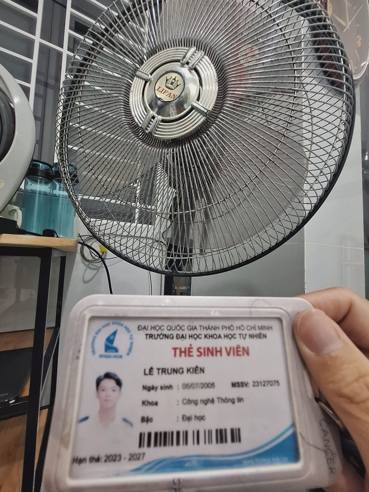
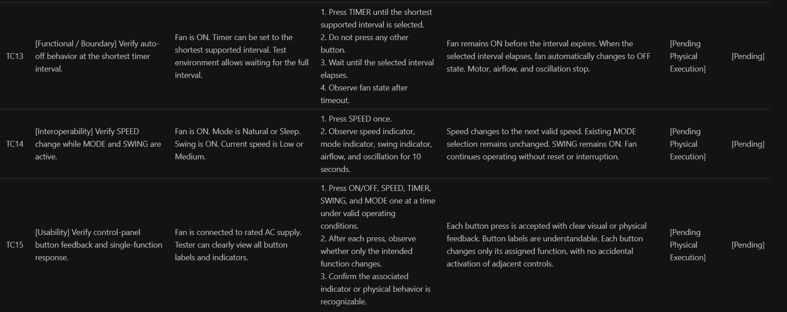
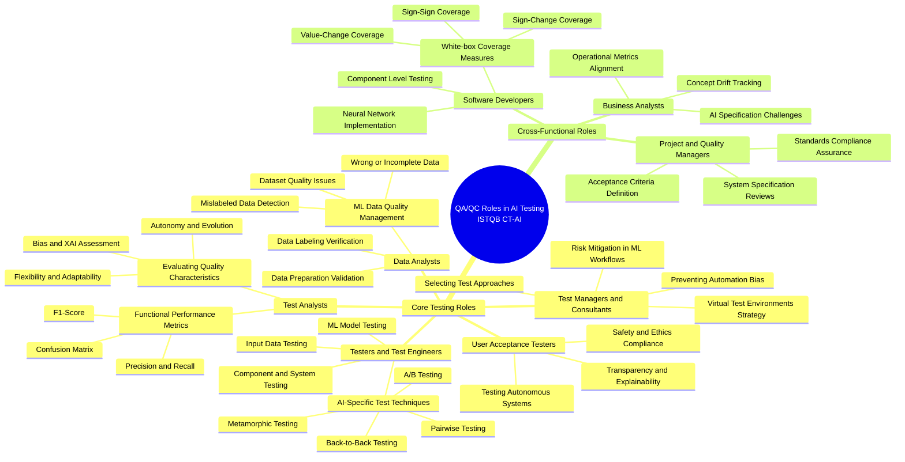

# HW01 Report — QA/QC Jobs · 20 Defects · Physical Product Testing

> StudentID: `23127075`  
> Student Name: `Lê Trung Kiên`  
> Course: Software Testing  
> Exercise: HW01  
> Submission Date: `04/06/2026`

---

## 1) Requirement 1 — QA/QC Job Market 2026+ (40 pts)

### 1.1 Summary
- Total postings collected: `10/10`
- Published within 60 days before submission: `Yes`
- Postings requiring AI/LLM/automation-AI skills: `9`

### 1.2 Job Postings

#### 1.2.1 Posting 01

- Job title: Business Analyst/Quality Assurance Analyst
- Company: Vion Consultants, Inc
- Location: Remote (primarily remote; occasional on-site in Baltimore, MD)
- Platform: SimplyHired
- Posting date: 01/06/2026
- Job URL: https://www.simplyhired.com/job/sZlt5OX6ynl8dQqiHuvfhuxrGj2L6sjsjSvNIQHIxLn0TRQetvLm8g
- Salary: From $40.00 an hour
- Requires AI/LLM/automation-AI skills? Y (manual + automation QA context)

**Job Description**

> **Full Job Description**
>
> Location: Primarily Remote (some on-site visit may be required in Baltimore, MD)
>
> Duration: 9 Months (possibility of extension)
>
> Candidate Location: Candidates within the DC/MD/VA metro area are preferred
>
> Job Summary
>
> We are seeking a dynamic and detail-oriented business analyst/quality assurance analyst to join our innovative technology team. In this role, you will be at the forefront of ensuring the quality and functionality of our software solutions, collaborating closely with developers, business analysts, and stakeholders. Your expertise will drive the development of robust test plans, execute comprehensive testing strategies, and facilitate seamless communication across teams to deliver high-quality products. If you thrive in a fast-paced environment and are passionate about software quality assurance and business analysis, this is your opportunity to make a meaningful impact.
>
> Responsibilities
> - Maintain requirements traceability across Strategic Brief, IA, and UX deliverables.
> - Document IA requirements and validate user-flow definitions.
> - Conduct stakeholder interviews and capture structured research outputs.
> - Track content workbook entries and validate retain/edit/remove dispositions.
> - Define mockup acceptance criteria and operate the defect log.
> - Trace UX Recommendations back to research and data points.
> - Serve as primary QA lead across testing, defect management, and pre-launch verification.
> - Author test plans and test cases for content edits, migration, redirects, and site testing.
> - Validate content edits across up to 500 high-priority pages.
> - Perform migration validation on a per-page basis.
> - Conduct WCAG 2.1 AA accessibility QA and remediation verification.
> - QA the redirect mapping for all 500 pages.
> - Manage hyper-care defect intake, prioritization, and triage.
>
> Required Qualification
> - Minimum 7 years of combined Business Analysis and QA experience.
> - Experience with content audits and content management workflows.
> - Strong manual testing experience with exposure to automated testing.
> - Proficient with defect tracking tools (Jira, Azure DevOps, or equivalent).
> - Demonstrated accessibility testing exposure.
>
> Preferred Qualifications
> - ISTQB or CSTE certification.
> - Drupal-based testing experience.
> - Experience validating migrated content at scale.
> - Hands-on experience with WCAG/Section 508 tooling (axe, WAVE, NVDA, JAWS).
>
> Pay: From $40.00 per hour
>
> Application Question(s)
> - Will you now or in the future require sponsorship to work in the US?
> - Do you have experience performing accessibility testing?
> - Do you have experience with Jira, Azure DevOps, or equivalent?
>
> License/Certification: ISTQB or CSTE certification (Preferred)
>
> Work Location: Hybrid remote in Baltimore, MD 21202

**Required Skills**

- Business analysis and stakeholder interviews.
- Requirements traceability across Strategic Brief, IA, and UX deliverables.
- Content audit/workbook validation, mockup acceptance criteria, and defect-log operation.
- Test planning/test cases for content migration, redirects, and site testing.
- WCAG 2.1 AA/Section 508 accessibility testing with Jira/Azure DevOps, Drupal, axe, WAVE, NVDA, and JAWS.

**AI Impact Analysis (1–2 sentences)**

- This role is a QA lead role for content migration, accessibility, redirects, and pre-launch verification, so AI can help draft traceability matrices, test cases, and defect summaries.
- Human review still matters because WCAG findings, content-retention decisions, and launch-risk triage require context-sensitive judgment.

**Evidence**

---

#### 1.2.2 Posting 02

- Job title: AI Chatbot Tester
- Company: Alignerr
- Location: Vietnam (Remote)
- Platform: LinkedIn
- Posting date: 28/05/2026
- Job URL: https://www.linkedin.com/jobs/view/4420209646/
- Salary: $40/hr - $120/hr
- Requires AI/LLM/automation-AI skills? Y

**Job Description**

> **About the job**
>
> About The Role
>
> What if your opinion could make AI smarter, safer, and more helpful for millions of people? As an AI Chatbot Tester with Alignerr, that's exactly what you'll do. We're looking for curious, thoughtful individuals to engage with cutting-edge AI chatbots, evaluate their responses, and provide the human feedback that drives real improvement in AI systems.
>
> This is a fully remote, flexible contract role — work on your own schedule, from anywhere.
>
> Organization: Alignerr  
> Type: Hourly Contract  
> Location: Remote  
> Commitment: 10–40 hours/week
>
> What You'll Do
> - Hold conversations with AI chatbots across a wide range of topics — from everyday questions to creative challenges.
> - Rate responses for helpfulness, accuracy, tone, and safety.
> - Identify issues such as factual errors, awkward phrasing, bias, or inappropriate outputs.
> - Push the limits of AI with creative, nuanced, and challenging prompts.
> - Record structured feedback that directly informs how AI systems are improved.
> - Work independently and asynchronously on your own schedule.
>
> Who You Are
> - Naturally curious — you enjoy exploring ideas across different topics and asking great questions.
> - Able to evaluate written responses critically and objectively.
> - Clear and concise in your written communication.
> - Comfortable navigating chat-based digital interfaces.
> - Reliable and self-motivated when working independently.
> - No technical background or prior AI experience required.
>
> Nice to Have
> - Experience in writing, editing, journalism, research, or customer service.
> - Familiarity with AI tools or chatbot platforms.
> - An eye for spotting subtle errors in logic, tone, or content.
>
> Why Join Us
> - Work on some of the most advanced AI projects in the world, partnering with top research labs.
> - Fully remote and flexible — set your own hours and work from anywhere.
> - Freelance autonomy: no micromanagement, no rigid schedules.
> - Meaningful work that directly shapes the quality and safety of AI used globally.
> - Potential for ongoing contracts and expanded project opportunities.

**Required Skills**

- AI chatbot conversation testing across broad topics.
- Response rating for helpfulness, accuracy, tone, and safety.
- Factual-error, awkward-phrasing, bias, and inappropriate-output detection.
- Adversarial/nuanced prompt design to challenge chatbot limits.
- Structured feedback writing, critical written evaluation, asynchronous remote work, and chatbot-platform familiarity.

**AI Impact Analysis (1–2 sentences)**

- This is a direct AI-era QA role where the product under test is LLM behavior, not only deterministic software flows.
- Human-in-the-loop testers improve model safety and usefulness by challenging chatbots, detecting subtle failures, and converting judgment into structured training feedback.

**Evidence**

---

#### 1.2.3 Posting 03

- Job title: Fresher Full-stack Test Engineer (QA/QC/Tester)
- Company: KMS Technology, Inc.
- Location: Ho Chi Minh City, Ho Chi Minh City, Vietnam (On-site)
- Platform: LinkedIn
- Posting date: 29/05/2026
- Job URL: https://www.linkedin.com/jobs/view/4417931013/
- Salary: Not listed
- Requires AI/LLM/automation-AI skills? Y

**Job Description**

> **About the job**
>
> Building Products & Systems that Shape the Future
>
> KMS Technology is a strategic engineering company helping businesses turn bold ideas into high-impact solutions—faster. Founded in 2009 as a U.S.-based services company, we’ve grown into a global organization with locations in the US, Vietnam, Mexico and Poland. KMS is trusted globally for the quality of our engineering and consulting services. We bring deep expertise in product development and quality assurance, Data & AI-native engineering, and delivery excellence to every engagement. Our mission is to help customers build what’s next—accelerating innovation, crafting brilliant solutions, and creating real-world impact. At KMS, we believe sustainable growth is built on the success of our clients and employees and in making a lasting contribution to our communities.
>
>Job Description
>
> Your key responsibilities
> - Develop a strong understanding of domain knowledge and client testing processes to execute testing activities effectively.
> - Work closely with the project team on daily tasks and participate in sprint demo meetings with clients.
> - Develop, maintain, and execute test cases/test scripts.
> - Identify, report, track, and monitor defects using the defect tracking system.
> - Prepare and review test documentation to ensure accuracy and completeness.
> - Address issues related to testing quality and suggest improvements.
> - Communicate test progress, results, and quality risks both internally and directly with the client.
>
> Qualifications
> - 4th-year student or recent graduate with a Bachelor's degree in Information Technology, Computer Science, Software Engineering, or a related field, with less than one year of experience.
> - Strong IT background with a GPA of 7.5+ and academic transcript attached when submitting CV.
> - Upper-intermediate or higher English proficiency, both written and verbal.
> - Minimum 3-month internship experience in software testing, automation testing, or a related field is a plus.
> - Strong self-learning ability with a proactive, growth-oriented mindset.
> - Excellent analytical and problem-solving skills.
> - Ability to work independently and collaborate effectively in a team.
>
> Technical requirements
> - Solid understanding of software testing concepts and methodologies, including manual, automation, integration, unit, and API testing. 
> - Solid programming skills in Python / Java / JavaScript, or other relevant languages. 
> - Familiarity with testing tools (e.g., Selenium, Katalon, Playwright, Appium, JUnit), as well as tools for API testing (e.g., Postman), is a plus
>
> Nice to have
> - Experience using AI chat tools (ChatGPT, Claude, Gemini, etc.) for research, debugging, and learning
> - Familiarity with at least one AI coding assistant (GitHub Copilot, Cursor, Claude Code, or similar)
> - Ability to write clear, contextual prompts to generate code snippets, unit tests, or documentation
> - Awareness of AI output limitations and responsible AI use (data privacy, handling of sensitive client data)
>
> Additional Information
>
> BE YOUR BEST WITH KMS
>
> - Working in one of the Best Places to Work in Vietnam
> - Building large-scale & global software products
> - Working & growing with Passionate & Talented Team
> - Diverse careers opportunities with Software Outsourcing, Software Product Development, IT Solutions & Consulting
> - Attractive Salary and Benefits
> - Performance appraisal twice a year and performance bonus
> - Onsite opportunities: short-term and long-term assignments in North American (U.S, Canada), Europe, Asia. 
> - Flexible working time
> - Various training on hot-trend technologies, best practices, and soft skills
> - Premium healthcare insurance for you and your loved ones
> - Company trip, big annual year-end party every year, team building,... 
> - Fitness & sports activities: football, tennis, table tennis, badminton, yoga,... 
> - Joining community development activities: 1% Pledge, charity every quarter, blood donation, public seminars, career > - orientation talks,.. 
> - Free in-house entertainment facilities (foosball, ping pong, gym,...), coffee (latte, cappuccino, espresso,...) and snack (instant noodles, cookies, candies,..)
>
> And much more...Send your Resume including Academic Transcript to join us and let yourself explore other fantastic things!

**Required Skills**

- Manual, automation, integration, unit, and API testing.
- Test case/test script development, defect reporting/tracking, and test documentation review.
- Python, Java, or JavaScript programming.
- Selenium, Katalon, Playwright, Appium, JUnit, and Postman familiarity.
- Sprint-demo participation and client communication.
- AI chat tools, AI coding assistants, contextual prompt writing, and responsible AI/data-privacy awareness.

**AI Impact Analysis (1–2 sentences)**

- This fresher role explicitly treats AI tools as productivity skills for research, debugging, learning, code snippets, unit tests, and documentation.
- It also shows employers expect junior QA engineers to understand AI limits and protect client data when using tools such as ChatGPT, Claude, Gemini, Copilot, Cursor, or Claude Code.

**Evidence**

---

#### 1.2.4 Posting 04

- Job title: Remote QA Tester Work From Home
- Company: Apply4U | Human-Assisted AI Job & Recruitment Platform
- Location: United Kingdom (Remote)
- Platform: LinkedIn
- Posting date: 02/06/2026
- Job URL: https://www.linkedin.com/jobs/view/4421658202/
- Salary: £13/hr - £16/hr
- Requires AI/LLM/automation-AI skills? Y (AI-assisted platform context)

**Job Description**

> **About the job**
>
> Remote QA Tester (Manual – Entry-Level)
>
> Location: United Kingdom (Remote)
>
> Salary: £13 – £16 per hour
>
> Job Type: Part-Time | Remote
>
> About the Role
>
> Apply4U is looking for a detail-oriented QA Tester to join our team. This is an entry-level role ideal for someone looking to start their career in software testing.
>
> Key Responsibilities
> - Test web and mobile applications for bugs and usability issues.
> - Document test cases, results, and report issues clearly.
> - Collaborate with developers to reproduce and resolve defects.
> - Ensure applications meet quality standards before release.
>
> What We’re Looking For
> - Basic knowledge of QA/testing principles (training can be provided).
> - Strong attention to detail and problem-solving skills.
> - Good written and verbal communication skills.
> - Enthusiasm to learn and grow within the QA field.
>
> Perks & Benefits
> - Work from home with flexible hours.
> - Gain valuable industry experience with real projects.
> - Supportive remote team environment.
>
> Apply Now:
> - Launch your QA career with Apply4U — apply today.

**Required Skills**

- Entry-level manual QA for web and mobile applications.
- Bug and usability issue identification.
- Test case/result documentation and clear issue reporting.
- Defect reproduction collaboration with developers.
- Quality-standard checks before release.
- Remote collaboration, attention to detail, problem solving, and written/verbal communication.

**AI Impact Analysis (1–2 sentences)**

- The posting does not require direct AI/LLM skills in the task list, but it belongs to a human-assisted AI recruitment platform where QA protects user-facing web and mobile workflows.
- AI can support repetitive test-case drafting and bug-report cleanup, while the entry-level tester still supplies human usability judgment and clear reproduction evidence.

**Evidence**

---

#### 1.2.5 Posting 05

- Job title: Senior QA Analyst
- Company: Zwift
- Location: Long Beach, CA (Remote-eligible US locations)
- Platform: SimplyHired
- Posting date: 23/05/2026
- Job URL: https://www.simplyhired.com/job/Hna9XHBa_Kh_Knfugud6Qt2EPSUDnPF-XcQkBUodtpTum8fs5mCqxg
- Salary: $70,500 - $110,000 a year
- Requires AI/LLM/automation-AI skills? Y (automation/API/CI context)

**Job Description**

> **Full Job Description**
>
> Location: Remote- Eligible US Locations
>
> About the role and about You:
>
> Zwift seeks an experienced Sr. QA Analyst to join our team. As part of our QA Team, you will be responsible for ensuring test coverage across Zwift's family of software products. You will develop test plans, create test cases for new features and see our end-to-end testing through. You will help influence and acquire the methods, practices, and tools we'll use to drive how we test into the future.
>
> What you'll do:
> - Foster strong, communicative team spirit supporting our globally full-stack development efforts, supporting frontend and backend.
> - Collaborate with cross-functional teams, including developers, product managers, and designers, to create detailed test plans and test cases based on project requirements and specifications.
> - Define test strategy and lead testing from requirements gathering to release phase.
> - Organize and perform regression and feature testing to reveal bugs in software.
> - Craft detailed, reproducible, and concise bug reports.
> - Help design, refine, and distribute QA reports and feedback to development, product managers, customer support, and senior management.
> - Participate in technical design and provide a voice for testability and quality.
> - Continually improve test cases to ensure coverage on all Zwift software products.
> - Identify, source, define, and implement useful, specialized tools and/or methods to benefit process, automation, and reporting.
>
> What we're looking for:
> - 4+ years working in Quality Assurance focused on Mobile Application testing (iOS/Android), API testing, Server testing.
> - Experience in leading testing for client-server applications and native apps.
> - Strong analytical problem-solving skills.
> - 2+ years of recent experience using JIRA and TestMo to support Agile development teams.
> - Experience working in Agile/Scrum environments with cross-functional teams.
> - Ability to design and write effective test strategies for complex systems and features.
> - Deep understanding and experience in QA methodologies, tools, and practices.
> - Strong analytical and problem-solving skills with the ability to operate independently.
> - Database validation testing (SQL/NoSQL) to ensure data integrity and consistency.
> - Experience with CI/CD tools (Jenkins, GitHub Actions, GitLab CI) and test integration.
> - Bachelor's Degree in Computer Science or a related technical field, or equivalent demonstrable experience and ability.
>
> Bonus points:
> - Experience using test tools such as Appium, Postman, and JavaScript.
> - Experience in testing microservices.
> - Passion for cycling, running and/or fitness.
> - Passion for video games and web technologies.
> - Experienced Zwifter.
>
> For All US Based Full-Time Positions:
> 
> The base salary for this position ranges between $70,500 to $110,000. The base salary will be based on a number of factors including the role offered, the individual's job-related knowledge, skills, qualifications, and geographic location. In addition to base salary, Zwift is proud to offer a comprehensive and competitive benefits package for all eligible employees which also includes performance bonuses, equity, and a full range of medical, financial, and other perks and benefits.
>
> If Zwift determines in any stage of our interviews that any AI tools are being used without disclosure or citation, your candidacy will be disqualified.
>
> How to stand out among the rest:
>
> Your resume/CV is enough to show off your skills, accomplishments, and experience. However, if you choose to include a cover letter introducing us to your awesome personality, we will read that too.
>
> We strongly believe that different backgrounds and ideas are a competitive advantage; we hire candidates of any race, color, ancestry, religion, sex, national origin, sexual orientation, gender identity, age, marital or family status, disability, Veteran status, and any other status. Zwift is proud to be an Equal Opportunity Employer. If you have a disability or special need that requires accommodation, please let us know by emailing careers@zwift.com.
>
> Zwift, Inc. is an Equal Opportunity Employer.

**Required Skills**

- Senior QA strategy and test leadership from requirements to release.
- Mobile app testing for iOS/Android, client-server apps, native apps, APIs, and servers.
- Regression/feature testing, test plans/test cases, and reproducible bug reporting.
- QA reporting, testability review, Jira/TestMo, and Agile/Scrum collaboration.
- SQL/NoSQL data validation and CI/CD test integration.
- Appium, Postman, JavaScript, and microservices testing.

**AI Impact Analysis (1–2 sentences)**

- This role emphasizes senior ownership of test strategy, specialized QA tools, reporting, and future testing methods, while also warning applicants to disclose AI-tool use during interviews.
- AI may help analyze failures and draft reports, but the job signals that responsible and transparent AI use is becoming part of QA professionalism.

**Evidence**

---

#### 1.2.6 Posting 06

- Job title: Senior Test Analyst
- Company: Cognizant
- Location: Reston, VA (Remote)
- Platform: SimplyHired
- Posting date: 01/06/2026
- Job URL: https://www.simplyhired.com/job/Z384WERQ3uUYT3LmAcdqMvq7be7xD7HcPE8ILoBK1d45P_UUycFjSw
- Salary: $53,477 - $92,500 a year
- Requires AI/LLM/automation-AI skills? Y (automation/API testing)

**Job Description**

> **Full Job Description**
>
> About the role
>
> As a Senior Test Analyst, you will make an impact by ensuring the quality, reliability, and performance of applications through robust test automation and comprehensive testing practices. You will be a valued member of the QA team and work collaboratively with developers, business stakeholders, and cross-functional Agile teams to deliver high-quality solutions.
>
> In this role, you will:
> - Develop and maintain automated test scripts using Java, Selenium WebDriver, and Rest Assured.
> - Execute functional, regression, smoke, and API testing activities to ensure product quality.
> - Design, create, and maintain test cases, test data, and test documentation.
> - Analyze requirements to ensure adequate test coverage and identify gaps.
> - Identify, log, track, and retest defects using Jira or similar tools.
>
> Work model
>
> We strive to provide flexibility wherever possible. Based on this role’s business requirements, this is a remote position open to qualified applicants in Reston, VA. Regardless of your working arrangement, we are here to support a healthy work-life balance through our various wellbeing programs.
>
> The working arrangements for this role are accurate as of the date of posting. This may change based on the project you’re engaged in, as well as business and client requirements.
>
> What you need to have to be considered
> - 5+ years of experience in software testing and test automation.
> - Hands-on experience with Java, Selenium WebDriver, and Rest Assured.
> - Strong understanding of API testing, SDLC, STLC, and Agile methodologies.
> - Experience with Git, Jira, and CI/CD tools such as Jenkins or GitHub Actions.
> - Strong analytical, troubleshooting, and communication skills.
>
> These will help you stand out
> - Experience using GitHub Copilot or AI-assisted tools to accelerate testing productivity.
> - Ability to collaborate effectively with cross-functional Agile teams.
> - Strong focus on continuous quality improvement and process optimization.
> - Experience in designing scalable and maintainable automation frameworks.
> - Exposure to modern DevOps and test automation practices.
>
> Salary and Other Compensation
> - Applications will be accepted until June 05, 2026.
> - The annual salary for this position is between $53,477 - $92,500 depending on experience and other qualifications of the successful candidate.
> - This position is also eligible for Cognizant’s discretionary annual incentive program, based on performance and subject to the terms of Cognizant’s applicable plans.
>
> Benefits
>
> Cognizant offers the following benefits for this position, subject to applicable eligibility requirements:
> - Medical/Dental/Vision/Life Insurance.
> - Paid holidays plus Paid Time Off.
> - 401(k) plan and contributions.
> - Long-term/Short-term Disability.
>
> Cognizant will only consider applicants for this position who are legally authorized to work in the United States without company sponsorship.
> - Please note, this role is not able to offer visa transfer or sponsorship now or in the future*

**Required Skills**

- 5+ years software testing and test automation.
- Java, Selenium WebDriver, and Rest Assured.
- Functional, regression, smoke, and API testing.
- Test case/test data/test documentation maintenance and requirement coverage analysis.
- Jira defect tracking/retesting, Git, Jenkins/GitHub Actions CI/CD, SDLC/STLC, and Agile collaboration.
- Scalable automation-framework design plus GitHub Copilot or AI-assisted testing tools.

**AI Impact Analysis (1–2 sentences)**

- This role directly names GitHub Copilot or AI-assisted tools as a differentiator for accelerating testing productivity.
- Enterprise QA is moving toward automation frameworks, API coverage, and CI/CD integration where AI can help generate scripts, find coverage gaps, and speed defect investigation.

**Evidence**

---

#### 1.2.7 Posting 07

- Job title: Clinical Quality Assurance Analyst
- Company: Themesoft Inc
- Location: Albany, NY (Remote)
- Platform: SimplyHired
- Posting date: 20/05/2026
- Job URL: https://www.simplyhired.com/job/ptTM58YVddK9WzZn6iqn01UByaalq4gjIXIW73GUMQDNUcEXbxgNUg
- Salary: $50 - $55 an hour
- Requires AI/LLM/automation-AI skills? N

**Job Description**

> **Full Job Description**
>
> Job Title: Clinical Quality Assurance Analyst
>
> Location: Albany - Remote with travel
> - Travel may be required up to 25% of the time.
> - Some overnight stays will be required, sometimes for the entire work week.
> - An expense budget will be available for travel costs.
>   - Expense invoices will be due within 7 days of travel.
> - Remote work will be allowed when not traveling.
>
> Key Responsibilities:
> - Evaluate child/youth’s records for compliance to applicable regulations.
>   - Clearly communicate evaluation requirements and follow up.
>   - Evaluate documentation against applicable State/Federal regulations.
>   - Collect data and documentation to support compliance findings.
>   - Utilize technology to convert hard copy documentation to electronic and submit via secure file transfer.
>   - Record, summarize, and communicate compliance findings for the Children’s Transformation Program.
>   - Assist in determining trends in non-compliance.
>   - Make appropriate and timely recommendations to project management.
> - Assist with the ongoing operationalization of project processes and procedures.
> - Assist with all internal and external reporting.
> - Build and maintain relationships with stakeholders to provide a high level of customer service.
> - Traveling to provider sites to perform case reviews.
>
> Required Qualifications:
> - Bachelor’s degree in public health, healthcare management, psychology, human services, or related field.
> - A minimum of 2 years of experience as a Healthcare Compliance Analyst, Auditor, Care Manager, or Medicaid Provider, in a role responsible for conducting oversight, compliance audits or chart reviews, or ensuring quality of care.
> - An equivalent combination of advanced education, training, and experience will be considered.
> - Experience with Medicaid fee-for-service and/or Managed Care billing.
> - Proficiency in MS Excel, MS Word, MS Outlook, MS Visio, MS PowerPoint and MS SharePoint.
> - Strong analytical and problem-solving abilities; able to evaluate data and make sound, evidence-based decisions.
>
> Preferred/Desired Qualifications:
> - Extensive knowledge of, and experience with, Home and Community-Based Services (HCBS) Waiver programs, including the 1915(c) NYS Children’s Waiver, either as a provider or compliance officer.
> - Experience working with eMedNY, CANS-NY, UAS-NY, Medicaid Health Homes, Medicaid Managed Care Organizations (MMCOs), or other related programs/systems.
> - Experience with NYS Medicaid billing, including the use of various Electronic Health Records (EHR) systems.
> - Experience working with Office of Mental Health (OMH), Office for People with Developmental Disabilities (OPWDD), or Office of Children and Families (OCFS).
> - Ability to manage time independently while meeting deadlines and adhering to high performance standards.
> - Experience with compliance audits or chart reviews.
> - Ability to work with and relate to staff and demonstrate active listening skills.
> - Process oriented and results-driven work strategy.
> - Ability to foster teamwork with all levels of management and staff.
> - Ability to work well independently and within a team.
> - Exceptional customer service relationship techniques, including superior verbal and written communication skills.
> - Excellent accuracy and attention to detail.

**Required Skills**

- Healthcare compliance audits and chart/record reviews.
- State/Federal regulation evaluation and Medicaid fee-for-service or Managed Care billing knowledge.
- Evidence collection, secure file transfer, compliance-findings documentation, and trend analysis.
- Internal/external reporting, stakeholder relationship management, and provider-site travel reviews.
- MS Excel, Word, Outlook, Visio, PowerPoint, SharePoint, and EHR/Medicaid systems exposure.

**AI Impact Analysis (1–2 sentences)**

- This is a non-AI clinical QA/compliance role focused on regulated healthcare documentation, Medicaid billing, and evidence-based findings.
- AI could help summarize records or detect trends, but compliance decisions, privacy handling, and provider recommendations require accountable human review.

**Evidence**

---

#### 1.2.8 Posting 08

- Job title: Quality Assurance Specialist | $11/hr Remote
- Company: Crossing Hurdles
- Location: Vietnam (Remote)
- Platform: LinkedIn
- Posting date: within 60-day window (promoted/current listing)
- Job URL: https://www.linkedin.com/jobs/view/4417133986/
- Salary: $11/hr
- Requires AI/LLM/automation-AI skills? Y

**Job Description**

> **Full Job Description**
>
> Position: LLM - AI Quality Analyst (Personalization) - Vietnamese
>
> Type: Short-term Contract  
> Compensation: $11/Hr  
> Location: Remote  
> Commitment: 8 hours per day with 4 hours overlap with PST  
> Duration: 2 Months  
> Start Date: Immediate
>
> Role Responsibilities
> - Evaluate nuanced and ambiguous AI-generated responses with a focus on personalization quality.
> - Analyze AI outputs and provide detailed quality assessments.
> - Support evaluation workflows for large language model personalization tasks.
> - Review and assess Vietnamese-language AI responses for accuracy, relevance, and contextual quality.
> - Collaborate with global operations teams in a fast-paced remote environment.
> - Contribute to improving AI quality through structured feedback and analytical insights.
>
> Requirements
> - Strong experience in data annotation, AI quality evaluation, content moderation, or related fields.
> - BS/BA degree or equivalent experience in Policy, Law, Ethics, Linguistics, Journalism, Computer Science, or related analytical fields.
> - Vietnamese proficiency with strong reading and writing comprehension skills.
> - Exceptional analytical thinking and ability to assess nuanced AI responses.
> - Willingness to use a primary personal Google account and enable personal data sources for genuine assessment tasks.
> - Full-time availability in local time zone with 4 hours overlap with PST.
> - Excellent communication and collaboration skills in remote work environments.
>
> Application Process
> - Apply/Easy Apply and check email for application form.
> - Fill Google form.
> - Complete the assessment link after shortlisting within 24 hours.

**Required Skills**

- LLM/AI quality evaluation and personalization-quality assessment.
- Nuanced and ambiguous AI-response review.
- Vietnamese-language accuracy, relevance, and context evaluation.
- Data annotation or content moderation experience.
- Structured quality feedback, analytical thinking, and remote collaboration with global operations teams.
- Policy, law, ethics, linguistics, journalism, or CS background plus personal-data-source assessment workflow awareness.

**AI Impact Analysis (1–2 sentences)**

- This role is built around LLM personalization QA, where testers judge whether AI responses fit Vietnamese-language context, user relevance, and quality expectations.
- It shows AI QA jobs need language expertise, ethical judgment, and careful handling of personal data sources, not only technical test automation.

**Evidence**

---

#### 1.2.9 Posting 09

- Job title: QA Engineer – Hybrid HCM (Experience in ML/Data or Security Testing)
- Company: Dwarves Foundation
- Location: Ho Chi Minh City, Vietnam (Hybrid)
- Platform: LinkedIn
- Posting date: 1 week ago
- Job URL: https://www.linkedin.com/jobs/view/4419144549/
- Salary: $1,800 - $2,000
- Requires AI/LLM/automation-AI skills? Y (ML/data testing scope)

**Job Description**

> **About the job**
>
> Position: QA Engineer  
> Location: Hybrid – Ho Chi Minh City  
> Working time: 09:00 AM – 06:00 PM (Monday – Friday)  
> Salary: $1,800 – $2,000
>
> 👉About the Role: This role focuses on automation testing across API, backend, and UI, with additional scope in ML features, security/authentication testing, and API partnerships/integration with client interactions
>
> Responsibilities
> - Design, develop, and maintain automated test frameworks for API, backend, and UI layers.
> - Implement and execute automated test scripts to ensure product quality and reliability.
> - Collaborate closely with Engineering, Product, and DevOps teams throughout the SDLC.
> - Apply Shift-Left Testing practices to identify defects early.
> - Integrate automated tests into CI/CD pipelines.
> - Perform test planning, execution, and defect tracking.
> - Analyze test results and provide clear quality insights and recommendations.
> - Contribute to testing standards, best practices, and continuous improvement initiatives.
> - Support junior QEs through technical guidance and knowledge sharing.
> - Participate in code reviews and quality discussions.
>
> Additional Responsibilities
> - Validate Machine Learning (ML) related features and data outputs.
> - Perform testing related to security, authentication, and authorization mechanisms.
> - Test and validate API partnerships and third-party integrations with client systems.
> - Ensure reliability and security of client-facing API interactions.
>
> Requirements
> - 5+ years of experience in Quality Control / Test Automation.
> - Strong experience in automated testing across API, backend, and UI.
> - Hands-on experience with Playwright, Cypress, RestAssured, and Postman.
> - Proficiency in one or more programming languages: Golang, TypeScript, Ruby, Python, or Java.
> - Solid understanding of software testing methodologies and SDLC.
> - Experience integrating automated tests into CI/CD pipelines.
> - Familiarity with Docker and containerized test environments.
> - Strong analytical and communication skills.
> - Good English communication skills.
>
> Preferred Qualifications
> - Experience testing Machine Learning (ML) workflows or ML-related features.
> - Knowledge of security testing, including authentication, authorization, and encryption.
> - Experience validating API integrations or third-party services.
> - Experience working in microservices-based architectures.
> - Familiarity with Kubernetes.
>
> Candidate Profile
> - Strong hands-on automation engineer with senior-level ownership
> - Quality-driven mindset with high attention to detail
> - Comfortable working in fast-paced engineering environments 
> --------------------------------------------------
>
> Learn more about us:
>
> 🌐 Website: https://d.foundation
>
> 🔗 LinkedIn: https://www.linkedin.com/company/dwarvesf/

**Required Skills**

- Senior test automation and API/backend/UI automation-framework design.
- Automated test script implementation with Playwright, Cypress, RestAssured, and Postman.
- Golang, TypeScript, Ruby, Python, or Java programming.
- SDLC, Shift-Left Testing, CI/CD pipeline integration, Docker, and containerized test environments.
- Defect tracking, quality insights, code review participation, microservices, and Kubernetes exposure.
- ML feature/data-output validation, security/authentication/authorization/encryption testing, and API partnership/third-party integration testing.

**AI Impact Analysis (1–2 sentences)**

- This role shows QA expanding into ML-related feature validation, where correctness includes model/data outputs in addition to normal API, backend, and UI behavior.
- It also links AI-era QA with security, authentication, and third-party API reliability because ML features often depend on integrated data pipelines and client-facing services.

**Evidence**

---

#### 1.2.10 Posting 10

- Job title: Audio Quality Assurance Specialist | $50/hr Remote
- Company: Crossing Hurdles
- Location: United States (Remote)
- Platform: LinkedIn
- Posting date: 1 week ago
- Job URL: https://www.linkedin.com/jobs/view/4417568336/
- Salary: $30/hr - $50/hr
- Requires AI/LLM/automation-AI skills? Y

**Job Description**

> **About the job**
>
> Position: Audio Engineer
>
> Type: Contract  
> Compensation: $30 - $50/hour  
> Location: Remote  
> Commitment: 10-40 hrs/week
>
> Role Responsibilities
> - Conduct detailed quality assurance on audio recordings by identifying and documenting artifacts or anomalies.
> - Assess the severity of audio issues and classify them accurately for AI model training use.
> - Perform audio cleanup and restoration tasks to ensure data meets professional standards.
> - Annotate audio and video data with clear, concise notes to support AI/ML development.
> - Participate in labeling, review, and quality control processes for large-scale datasets.
> - Collaborate effectively with a distributed team, providing regular feedback and contributing to a culture of high standards.
>
> Requirements
> - Have a professional monitoring setup, including studio monitors or high-end headphones, suitable for critical listening tasks.
> - Possess a strong command of written and verbal English communication for precise issue reporting and team collaboration.
> - Have a deep understanding of audio quality assurance processes and artifact detection methodologies.
> - Have experience with audio restoration, cleanup, and editing workflows using industry-standard tools.
> - Be self-motivated, detail-oriented, and comfortable working independently in a remote environment.
>
> Application Process
> - Easy Apply on LinkedIn.
> - Check email for next steps.
> - Participate in resume evaluation and interview stage.

**Required Skills**

- Audio quality assurance and critical listening with studio monitors/high-end headphones.
- Artifact/anomaly detection and severity classification.
- Audio cleanup, restoration, and editing workflows.
- Data annotation for audio/video and labeling/review/quality-control processes for large datasets.
- Concise issue notes for AI/ML development, distributed-team collaboration, written/verbal English communication, and independent remote work.

**AI Impact Analysis (1–2 sentences)**

- This role shows multimodal AI creating specialized QA demand for audio datasets used in model training.
- The tester's domain expertise turns subjective audio defects into labeled, severity-classified feedback that improves AI/ML data quality.

**Evidence**

---

## 2) Requirement 2 — 20 Software Defects (2022–2026) (20 pts)

### 2.1 Summary
- Total defects: `20/20`
- AI/LLM-related defects: `7` (must be `>= 5`)
- AI bias/hallucination analysis entries: `20/20` (one per defect)

### 2.2 20 Software Defects

### Part 1: AI & Large Language Model (LLM) Defects

**1. CVE-2023-29374 (LangChain Prompt Injection)**
* **Source Link:** [CVE-2023-29374](https://cve.mitre.org/cgi-bin/cvename.cgi?name=CVE-2023-29374)
* **Description:** LangChain through version 0.0.131 allows prompt injection attacks against the `LLMMathChain` chain. A crafted prompt can execute arbitrary code through the Python `exec` method.
* **Severity:** Critical (CVSS 9.8)
* **Consequences:** Remote code execution on the server running the vulnerable LangChain application when untrusted prompts reach the affected chain.
* **Solution:** Upgrade LangChain to version 0.0.132 or later and avoid sending untrusted prompts to components that can execute generated code.
* **AI Hallucination/Bias:** The source names Python `exec`, not `numexpr.evaluate()`, as the execution path.

**2. CVE-2024-37032 (Ollama Path Traversal)**
* **Source Link:** [CVE-2024-37032](https://cve.mitre.org/cgi-bin/cvename.cgi?name=CVE-2024-37032)
* **Description:** Ollama before version 0.1.34 does not validate digest format when building model blob paths. Invalid digest values, including an initial `../` substring, can be mishandled.
* **Severity:** High (CVSS 8.8)
* **Consequences:** Path traversal through crafted digest values during model path handling. Impact should be described as filesystem path mishandling, not guaranteed full system takeover.
* **Solution:** Update Ollama to version 0.1.34 or later.
* **AI Hallucination/Bias:** Critical 9.8 and “full system takeover” overstated the source-backed severity and impact.

**3. CVE-2023-39325 (Go HTTP/2 Rapid Reset DoS)**
* **Source Link:** [CVE-2023-39325](https://cve.mitre.org/cgi-bin/cvename.cgi?name=CVE-2023-39325)
* **Description:** A malicious HTTP/2 client can rapidly create requests and immediately reset them, causing excessive server resource consumption in Go HTTP/2 servers.
* **Severity:** High (CVSS 7.5)
* **Consequences:** Denial of service through excessive handler goroutine/resource consumption, even though the total number of concurrent streams is bounded.
* **Solution:** Apply patched Go and `golang.org/x/net/http2` versions that bound simultaneously executing handler goroutines to the stream concurrency limit.
* **AI Hallucination/Bias:** The source is Go HTTP/2 rapid reset DoS, not Anyscale Ray / ShadowRay.

**4. CVE-2024-24590 (ClearML Unsafe Deserialization)**
* **Source Link:** [CVE-2024-24590](https://cve.mitre.org/cgi-bin/cvename.cgi?name=CVE-2024-24590)
* **Description:** Allegro AI ClearML client SDK versions 0.17.0 through 1.14.2 can deserialize untrusted data. A maliciously uploaded artifact can run arbitrary code on an end user's system when interacted with.
* **Severity:** High (CVSS 8.0)
* **Consequences:** Arbitrary code execution on the user's system when the malicious artifact is opened or otherwise interacted with, not automatic execution on every worker preprocessing event.
* **Solution:** Upgrade ClearML client SDK to version 1.14.3 or later.
* **AI Hallucination/Bias:** The source severity is High and affected versions include 1.14.2, so 1.14.2 is not the fixed version.

**5. CVE-2024-21515 (OpenCart Reflected XSS)**
* **Source Link:** [CVE-2024-21515](https://cve.mitre.org/cgi-bin/cvename.cgi?name=CVE-2024-21515)
* **Description:** OpenCart versions from 4.0.0.0 have a reflected XSS issue in the `filename` parameter of the admin `tool/log` route.
* **Severity:** Medium (CVSS 4.2)
* **Consequences:** An attacker can trick a user into opening a crafted URL and steal the user's token. If the victim is an administrator, this can become a starting point for chained admin-functionality exploits.
* **Solution:** Apply OpenCart fixes for the admin redirect/XSS issue, avoid using malicious links while authenticated, and restrict or rename the admin directory as recommended by the source notes.
* **AI Hallucination/Bias:** The source describes OpenCart reflected XSS, not Flowise LLM RCE.

**6. CVE-2024-22419 (Vyper concat Buffer Overwrite)**
* **Source Link:** [CVE-2024-22419](https://cve.mitre.org/cgi-bin/cvename.cgi?name=CVE-2024-22419)
* **Description:** Vyper's `concat` built-in can write past the bounds of its allocated memory buffer because `build_IR` for `concat` does not properly follow the copy-function API.
* **Severity:** High (CVSS 7.3)
* **Consequences:** Valid contract data can be overwritten, changing smart-contract semantics in length-dependent cases that may not appear during normal testing.
* **Solution:** Upgrade Vyper to version 0.4.0 or later.
* **AI Hallucination/Bias:** The source is a Vyper smart-contract compiler issue, not a ComfyUI workflow-execution flaw.

**7. CVE-2024-34359 (llama-cpp-python Jinja2 SSTI)**
* **Source Link:** [CVE-2024-34359](https://cve.mitre.org/cgi-bin/cvename.cgi?name=CVE-2024-34359)
* **Description:** `llama-cpp-python` versions 0.2.30 through 0.2.71 load chat-template metadata from `.gguf` models and parse it with a sandbox-less Jinja2 environment.
* **Severity:** Critical (CVSS 9.7)
* **Consequences:** A crafted model chat template can trigger Jinja2 server-side template injection and lead to remote code execution when the template is rendered.
* **Solution:** Upgrade `llama-cpp-python` to a patched version outside the affected 0.2.30 through 0.2.71 range and avoid loading untrusted model files.
* **AI Hallucination/Bias:** The source describes llama-cpp-python Jinja2 SSTI/RCE, not LlamaIndex SSRF.

### Part 2: Core Infrastructure & Enterprise Software Defects

**8. CVE-2024-3094 (XZ Utils Malicious Backdoor)**
* **Source Link:** [CVE-2024-3094](https://cve.mitre.org/cgi-bin/cvename.cgi?name=CVE-2024-3094)
* **Description:** Malicious code was deliberately injected into upstream XZ Utils tarballs starting with version 5.6.0. The obfuscated build process modified `liblzma` functions used by linked software.
* **Severity:** Critical (CVSS 10.0)
* **Consequences:** On affected builds, software linked against the modified `liblzma` could have its data interactions intercepted and modified. Practical OpenSSH exploitation depended on specific build conditions and attacker-controlled trigger material.
* **Solution:** Immediately downgrade XZ Utils to a safe version such as 5.4.6 or install distribution-specific vendor security updates.
* **AI Hallucination/Bias:** The original consequence was too broad because exploitation depended on affected builds and a matching trigger/private key.

**9. CVE-2024-6387 (OpenSSH "regreSSHion" Race Condition)**
* **Source Link:** [CVE-2024-6387](https://cve.mitre.org/cgi-bin/cvename.cgi?name=CVE-2024-6387)
* **Description:** A regression of CVE-2006-5051 in OpenSSH server (`sshd`) introduces a race condition where some signals can be handled unsafely.
* **Severity:** High (CVSS 8.1)
* **Consequences:** An unauthenticated remote attacker may be able to trigger the race by failing to authenticate within the grace period, with possible code execution on vulnerable glibc-based Linux targets.
* **Solution:** Upgrade OpenSSH to version 9.8p1 or set `LoginGraceTime 0` as a temporary workaround.
* **AI Hallucination/Bias:** Root execution should be phrased as possible and timing-dependent, not guaranteed.

**10. CVE-2022-22965 (Spring4Shell)**
* **Source Link:** [CVE-2022-22965](https://cve.mitre.org/cgi-bin/cvename.cgi?name=CVE-2022-22965)
* **Description:** A Spring MVC or Spring WebFlux application running on JDK 9+ may be vulnerable to remote code execution through data binding.
* **Severity:** Critical (CVSS 9.8)
* **Consequences:** The widely known exploit requires Tomcat as a WAR deployment. Spring Boot executable JAR deployments are not vulnerable to that exploit path, though the underlying vulnerability is more general.
* **Solution:** Upgrade Spring Framework to versions 5.3.18 / 5.2.20 or higher.
* **AI Hallucination/Bias:** The source requires specific JDK 9+ and Tomcat WAR deployment conditions for the common exploit.

**11. CVE-2023-38831 (WinRAR Arbitrary Execution)**
* **Source Link:** [CVE-2023-38831](https://cve.mitre.org/cgi-bin/cvename.cgi?name=CVE-2023-38831)
* **Description:** WinRAR before version 6.23 can execute arbitrary code when a user attempts to view a benign file inside a crafted ZIP archive that also contains a same-named folder with executable content.
* **Severity:** High (CVSS 7.8)
* **Consequences:** Arbitrary code execution occurs after user interaction with the crafted archive; it is not a purely silent, no-click server-side compromise.
* **Solution:** Upgrade WinRAR to version 6.23 or newer.
* **AI Hallucination/Bias:** The exploit still depends on user interaction with a crafted archive.

**12. CVE-2023-4863 (libwebp Heap Buffer Overflow)**
* **Source Link:** [CVE-2023-4863](https://cve.mitre.org/cgi-bin/cvename.cgi?name=CVE-2023-4863)
* **Description:** A heap buffer overflow in `libwebp` in Google Chrome before 116.0.5845.187 and `libwebp` before 1.3.2 allows out-of-bounds memory write through crafted WebP content.
* **Severity:** High (CVSS 8.8; Chromium severity Critical)
* **Consequences:** Memory corruption and possible remote code execution when crafted WebP content is processed by a vulnerable browser or application.
* **Solution:** Update Chrome, Firefox, Electron apps, or other parent software to versions that include the patched `libwebp` 1.3.2 or later.
* **AI Hallucination/Bias:** CVSS 8.8 maps to High even though Chromium separately rated the issue Critical.

**13. CVE-2024-21626 (runc Container Escape)**
* **Source Link:** [CVE-2024-21626](https://cve.mitre.org/cgi-bin/cvename.cgi?name=CVE-2024-21626)
* **Description:** `runc` 1.1.11 and earlier leak an internal file descriptor, allowing a newly spawned container process to have a working directory in the host filesystem namespace.
* **Severity:** High (CVSS 8.6)
* **Consequences:** A malicious image or `runc exec` workflow can gain host filesystem access. Some variants can overwrite semi-arbitrary host binaries and produce complete container escape.
* **Solution:** Update `runc` to version 1.1.12 or higher.
* **AI Hallucination/Bias:** CVSS 8.6 is High, and complete escape applies to specific variants rather than every exploit path.

**14. CVE-2024-3400 (Palo Alto Networks PAN-OS Injection)**
* **Source Link:** [CVE-2024-3400](https://cve.mitre.org/cgi-bin/cvename.cgi?name=CVE-2024-3400)
* **Description:** A command injection issue from arbitrary file creation affects the GlobalProtect feature in specific PAN-OS versions and feature configurations.
* **Severity:** Critical (CVSS 10.0)
* **Consequences:** An unauthenticated attacker can execute arbitrary code with root privileges on vulnerable firewall deployments. Cloud NGFW, Panorama appliances, and Prisma Access are not impacted by this CVE.
* **Solution:** Apply Palo Alto Networks hotfixes for affected PAN-OS 10.2, 11.0, and 11.1 releases and ensure vulnerable GlobalProtect gateway configurations are not exposed.
* **AI Hallucination/Bias:** The source limits risk to specific PAN-OS versions and GlobalProtect feature configurations.

**15. CVE-2022-42889 (Text4Shell)**
* **Source Link:** [CVE-2022-42889](https://cve.mitre.org/cgi-bin/cvename.cgi?name=CVE-2022-42889)
* **Description:** Apache Commons Text versions 1.5 through 1.9 include default string lookups such as `script`, `dns`, and `url` in variable interpolation.
* **Severity:** Critical (CVSS 9.8)
* **Consequences:** Applications may execute code or contact remote servers if untrusted configuration values reach the vulnerable interpolation defaults.
* **Solution:** Upgrade Apache Commons Text to version 1.10.0 or higher, which disables the problematic interpolators by default.
* **AI Hallucination/Bias:** The impact depends on attacker-controlled input reaching vulnerable interpolation.

**16. CVE-2023-22515 (Atlassian Confluence Privilege Escalation)**
* **Source Link:** [CVE-2023-22515](https://cve.mitre.org/cgi-bin/cvename.cgi?name=CVE-2023-22515)
* **Description:** Publicly accessible Atlassian Confluence Data Center and Server instances could be exploited by external attackers to create unauthorized Confluence administrator accounts.
* **Severity:** Critical (CVSS 10.0)
* **Consequences:** Attackers can create administrator accounts and access or take over affected Confluence instances. Atlassian Cloud sites are not affected.
* **Solution:** Upgrade to fixed Confluence versions such as 8.3.3, 8.4.3, 8.5.2, or newer fixed releases.
* **AI Hallucination/Bias:** “Broken object-level authorization” was imprecise; the source describes unauthenticated administrator-account creation.

**17. CVE-2024-2961 (glibc iconv Buffer Overflow)**
* **Source Link:** [CVE-2024-2961](https://cve.mitre.org/cgi-bin/cvename.cgi?name=CVE-2024-2961)
* **Description:** The `iconv()` function in GNU C Library 2.39 and older can overflow the output buffer by up to 4 bytes when converting to the ISO-2022-CN-EXT character set.
* **Severity:** High (CVSS 8.1)
* **Consequences:** The official impact is application crash or neighboring-variable overwrite. Remote code execution requires an additional exploit chain and should not be presented as direct default impact.
* **Solution:** Apply the upstream glibc patch or install updated Linux distribution packages.
* **AI Hallucination/Bias:** RCE needs careful conditional wording because the source names crash / neighboring-variable overwrite.

**18. CVE-2023-50164 (Apache Struts 2 File Upload Exploit)**
* **Source Link:** [CVE-2023-50164](https://cve.mitre.org/cgi-bin/cvename.cgi?name=CVE-2023-50164)
* **Description:** Apache Struts allows attackers to manipulate file-upload parameters to enable path traversal during multipart uploads.
* **Severity:** Critical (CVSS 9.8)
* **Consequences:** Under some circumstances, an attacker can upload a malicious file that can be used for remote code execution. The exploitability depends on deployment and upload handling.
* **Solution:** Update Apache Struts to versions 2.5.33, 6.3.0.2, or later.
* **AI Hallucination/Bias:** RCE is source-backed but conditional, not guaranteed for every upload path.

**19. CVE-2022-26134 (Atlassian Confluence OGNL Injection)**
* **Source Link:** [CVE-2022-26134](https://cve.mitre.org/cgi-bin/cvename.cgi?name=CVE-2022-26134)
* **Description:** Affected Confluence Server and Data Center versions contain an OGNL injection vulnerability that allows unauthenticated attackers to execute arbitrary code.
* **Severity:** Critical (CVSS 9.8)
* **Consequences:** Complete unauthenticated remote code execution on vulnerable Confluence Server or Data Center instances.
* **Solution:** Upgrade Confluence to fixed versions such as 7.4.17, 7.13.7, 7.14.3, 7.15.2, 7.16.4, 7.17.4, 7.18.1, or later supported fixed releases.
* **AI Hallucination/Bias:** “Structural code parsing from HTTP request headers” was unclear; the source says unauthenticated OGNL injection.

**20. CVE-2024-47575 (Fortinet FortiManager "FortiJump")**
* **Source Link:** [CVE-2024-47575](https://cve.mitre.org/cgi-bin/cvename.cgi?name=CVE-2024-47575)
* **Description:** Fortinet FortiManager and FortiManager Cloud contain a missing-authentication vulnerability for a critical function across multiple 7.x and 6.x branches.
* **Severity:** Critical (CVSS 9.8)
* **Consequences:** An unauthenticated attacker can execute arbitrary code or commands through specially crafted requests.
* **Solution:** Upgrade to fixed FortiManager/FortiManager Cloud branches, including 7.6.1, 7.4.5, 7.2.8, 7.0.13, 6.4.15, 6.2.13, or vendor-designated Cloud fixed versions as applicable.
* **AI Hallucination/Bias:** The source impact is arbitrary code/command execution, and the fix list includes older affected branches.

## 3) Requirement 3 — Test Cases for ONE Physical Product (40 pts)

### 3.1 Device Declaration
- Device type: `Domestic stand fan with electronic/soft-button control panel`
- Brand: `Lifan`
- Model: `LIFAN Đ-16RC-0`
- Year: `Don't remember`
- Serial number (masked middle 4 chars): `Don't remember`

### 3.2 Required Device Evidence

### 3.3 Test Cases (15 total)

| **TC ID** |                                                         **Objective**                                                        |                                                             **Input / Pre-conditions**                                                             |                                                                                          **Execution Steps**                                                                                          |                                                                                                 **Expected Result**                                                                                                |                 **Actual Result**                | **Verdict** |
|:---------:|:----------------------------------------------------------------------------------------------------------------------------:|:--------------------------------------------------------------------------------------------------------------------------------------------------:|:-----------------------------------------------------------------------------------------------------------------------------------------------------------------------------------------------------:|:------------------------------------------------------------------------------------------------------------------------------------------------------------------------------------------------------------------:|:------------------------------------------------:|:-----------:|
|  **TC01** | [Functional] Verify that the ON/OFF button powers on the fan from standby/off state.                                         | Fan is assembled safely, connected to rated AC supply, and currently OFF. Control panel is visible.                                                | 1. Press the ON/OFF button once. 2. Observe fan operation and panel indicators for 5 seconds.                                                                                                      | Fan changes to ON state. Fan motor runs and produces airflow. Control panel shows active power status. No other function requires manual activation to start basic operation.                                      | The fan is still OFF                             | Failed      |
|  **TC02** | [Functional] Verify that the ON/OFF button powers off the fan during operation.                                              | Fan is ON and producing airflow at any valid speed.                                                                                                | 1. Press the ON/OFF button once. 2. Observe motor, airflow, swing state, and panel indicators for 5 seconds.                                                                                       | Fan changes to OFF state. Motor stops, airflow stops, oscillation stops if active, and control panel no longer indicates active operation except any allowed standby indication.                                   | The fan is still ON                              | Failed      |
|  **TC03** | [Functional] Verify SPEED cycles from Low to Medium.                                                                         | Fan is ON. Current speed indicator is Low.                                                                                                         | 1. Press SPEED once. 2. Observe the speed indicator and airflow intensity.                                                                                                                         | Speed changes from Low to Medium. Medium speed indicator is active. Airflow becomes stronger than Low.                                                                                                             | Same as expected result                     | Passed      |
|  **TC04** | [Functional] Verify SPEED cycles from Medium to High.                                                                        | Fan is ON. Current speed indicator is Medium.                                                                                                      | 1. Press SPEED once. 2. Observe the speed indicator and airflow intensity.                                                                                                                         | Speed changes from Medium to High. High speed indicator is active. Airflow becomes stronger than Medium.                                                                                                           | Same as expected result                     | Passed      |
|  **TC05** | [Functional / Boundary] Verify SPEED wraps from High back to Low.                                                            | Fan is ON. Current speed indicator is High.                                                                                                        | 1. Press SPEED once. 2. Observe the speed indicator and airflow intensity.                                                                                                                         | Speed changes from High to Low. Low speed indicator is active. Airflow returns to the lowest available intensity. No undefined speed state appears.                                                                | Same as expected result                     | Passed      |
|  **TC06** | [Functional] Verify MODE cycles from Normal to Natural.                                                                      | Fan is ON. Current mode indicator is Normal.                                                                                                       | 1. Press MODE once. 2. Observe the mode indicator and airflow profile for at least 10 seconds.                                                                                                     | Mode changes from Normal to Natural. Natural mode indicator is active. Fan remains ON and uses the Natural wind profile.                                                                                           | The MODE button did not function                 | Failed      |
|  **TC07** | [Functional] Verify MODE cycles from Natural to Sleep.                                                                       | Fan is ON. Current mode indicator is Natural.                                                                                                      | 1. Press MODE once. 2. Observe the mode indicator and airflow profile for at least 10 seconds.                                                                                                     | Mode changes from Natural to Sleep. Sleep mode indicator is active. Fan remains ON and uses the Sleep wind profile.                                                                                                | The MODE button did not function                 | Failed      |
|  **TC08** | [Functional / Boundary] Verify MODE wraps from Sleep back to Normal.                                                         | Fan is ON. Current mode indicator is Sleep.                                                                                                        | 1. Press MODE once. 2. Observe the mode indicator and airflow profile for at least 10 seconds.                                                                                                     | Mode changes from Sleep to Normal. Normal mode indicator is active. No undefined wind profile appears.                                                                                                             | The MODE button did not function                 | Failed      |
|  **TC09** | [Functional] Verify SWING enables horizontal oscillation.                                                                    | Fan is ON. Swing is currently OFF. Fan head has safe clearance for oscillation.                                                                    | 1. Press SWING once. 2. Observe fan head movement and swing indicator for 10 seconds.                                                                                                              | Horizontal oscillation starts. Swing indicator shows ON state. Fan continues producing airflow at the selected speed and mode.                                                                                     | Same as expected result                     | Passed      |
|  **TC10** | [Functional] Verify SWING disables horizontal oscillation.                                                                   | Fan is ON. Swing is currently ON and horizontal oscillation is visible.                                                                            | 1. Press SWING once. 2. Observe fan head movement and swing indicator for 10 seconds.                                                                                                              | Horizontal oscillation stops. Swing indicator shows OFF state. Fan continues producing airflow at the selected speed and mode.                                                                                     | Same as expected result                     | Passed      |
|  **TC11** | [Functional] Verify TIMER increments from no timer to the first supported timer interval.                                    | Fan is ON. Timer is currently OFF or no timer indicator is active.                                                                                 | 1. Press TIMER once. 2. Observe timer indicator immediately after the press.                                                                                                                       | Timer changes from OFF to the first supported auto-off interval. The corresponding timer indicator is active. Fan remains ON.                                                                                      | The TIMER button did not function                | Failed      |
|  **TC12** | [Functional / Boundary] Verify TIMER cycles through all supported intervals and returns to no-timer state.                   | Fan is ON. Timer indicator is visible. Manufacturer-supported timer interval markings are known from the panel/manual.                             | 1. Press TIMER repeatedly one step at a time. 2. After each press, record the active timer indicator. 3. Continue until the sequence passes the maximum supported interval.                     | Timer indicator advances exactly one interval per press. After the maximum supported interval, the next TIMER press returns to no-timer/OFF timer state. No skipped, duplicated, or undefined timer state appears. | The MODE button did not function                 | Failed      |
|  **TC13** | [Functional] Verify that the fan defaults to Low speed when powered ON from the standby/OFF state.                           | Fan is connected to rated AC supply and currently OFF. Control panel is clear and visible.                                                         | 1. Press the ON/OFF button once to power ON the fan. 2. Observe the active speed indicator and initial airflow intensity.                                                                          | Fan powers ON successfully. The fan speed automatically defaults to Low. The Low speed indicator is illuminated, and the initial airflow matches the Low setting.                                                  | The default speed is Medium, then change to Low | Failed      |
|  **TC14** | [Safety] Verify that the fan guard (grille) mesh layout prevents human fingers from making contact with the rotating blades. | Fan is fully assembled, powered ON, and the blades are rotating at High speed. A standard test finger or safe visual inspection tool is available. | 1. Gently attempt to pass a safe finger-sized probe through the front and rear fan guards at various gap locations. 2. Verify if the probe can reach the rotating blades.                          | The fan guard gaps are narrow enough to block the probe entirely. It is physically impossible for a finger to touch or come into dangerous proximity with the rotating fan blades from any angle.                  | Same as expected result                     | Passed      |
|  **TC15** | [Appearance / UI] Verify the legibility, print quality, and clarity of all text and markings on the fan body.                | Fan is placed in a well-lit test environment. Tester inspects the device from a standard user distance.                                            | 1. Read and inspect all text on the fan body (Brand logo "LIFAN", Model "Đ-16RC-0", and button labels: SPEED, TIMER, SWING, MODE, ON/OFF). 2. Check for printing defects, fading, or misspellings. | All text, symbols, and labels are perfectly legible, sharply printed, and easy to read. Font alignment is consistent, and there are no signs of smudging, faded ink, or spelling errors.                           | Same as expected result                     | Passed      |

### 3.4 Test Execution Video Log (>=5)

| Video ID | TC ID | Title | Platform | Link |
|---|---|---|---|---|
| VID-01 | TC-01 | [ 23127075 _ SOFTWARE TESTING ] TC 01 | YouTube Unlisted | https://www.youtube.com/watch?v=xYFowoA903U |
| VID-02 | TC-02 | [ 23127075 _ SOFTWARE TESTING ] TC 02 | YouTube Unlisted | https://www.youtube.com/watch?v=4-cxZAMtfmg |
| VID-03 | TC-03 | [ 23127075 _ SOFTWARE TESTING ] TC 03 | YouTube Unlisted | https://www.youtube.com/watch?v=EjQsOBYgneg |
| VID-04 | TC-13 | [ 23127075 _ SOFTWARE TESTING ] TC 13 | YouTube Unlisted | https://www.youtube.com/watch?v=zyAoDVczHws |
| VID-05 | TC-14 | [ 23127075 _ SOFTWARE TESTING ] TC 14 | YouTube Unlisted | https://www.youtube.com/watch?v=stYr6CmpUu8 |

### 3.5 AI-missed Edge Cases (>=3 mandatory)

**AI conversation screenshot proving AI did not generate it**

**Edge Cases Table**

| Edge Case ID | Test Case ID | Why AI Missed It | Why It Matters |
|---|---|---|---|
| EC-01 | TC-13 | AI misses the "default to Low speed upon power-on" case because of its spec-driven bias, focusing strictly on explicit button inputs while overlooking implicit hardware initialization rules. | It makes UX becomes weird because the default speed must be LOW |
| EC-02 | TC-14 | AI lacks real-world physical common sense and relies strictly on explicit specifications rather than anticipating implicit hazards or chaotic human behaviors. | If the user's finger touch the fan's blades, he / she gets injured |
| EC-03 | TC-15 | AI misses the UI legibility case because it operates purely on abstract textual data, rendering it blind to physical visual attributes like font size, contrast, paint quality, or real-world lighting conditions. | If the words / numbers printed on the fan are not readable, the users might make mistakes |

---

## 4) CLO Mapping (G9.1, G9.3)

### G9.1 — Understand

**Prompt AI tool for ISTQB-process mindmap**

> - Prompt: "Using the PDF file I provided, generate the QA/QC role mindmap in mermaid code."
> - Model: Gemini 3.1 Pro

**Mistakes**

1. The mindmap treats CT-AI syllabus topics as fixed role duties.
   - Example: `Testers and Test Engineers -> AI-Specific Test Techniques -> Pairwise Testing / Metamorphic Testing / Back-to-Back Testing / A/B Testing`.
   - Mistake: ISTQB CT-AI lists these as test techniques for AI-based systems, not duties assigned only to testers/test engineers.
   - Fix: Move them under `AI-Based System Test Techniques`.

2. The role taxonomy is not official responsibility mapping.
   - CT-AI names roles such as testers, test analysts, data analysts, test engineers, test consultants, test managers, UAT testers, software developers, project managers, quality managers, and business analysts as target audience.
   - Mistake: Gemini converted an audience list into a responsibility map, but the syllabus does not define exact branches per role.
   - Fix: Label this as `Target Audience / Related Roles`, or separate roles from syllabus knowledge areas.

3. ML functional performance metrics are incomplete.
   - Mindmap lists only `Confusion Matrix`, `Precision and Recall`, and `F1-Score`.
   - Mistake: CT-AI also covers `Accuracy`, `ROC curve`, `AUC`, `MSE`, `R-squared`, `intra-cluster metrics`, `inter-cluster metrics`, `silhouette coefficient`, benchmark suites, and metric limitations.
   - Fix: Add missing metrics or state these are only examples.

4. Quality characteristics are incomplete and merged incorrectly.
   - Mindmap lists `Flexibility and Adaptability`, `Autonomy and Evolution`, and `Bias and XAI Assessment`.
   - Mistake: CT-AI also includes `Ethics`, `Side Effects and Reward Hacking`, `Transparency`, `Interpretability`, `Explainability`, and `Safety`.
   - Also, `Bias and XAI Assessment` merges separate concepts.
   - Fix: Follow CT-AI Chapter 2 structure directly.

5. Some responsibilities are assigned to weakly related roles.
   - Example: `User Acceptance Testers -> Safety and Ethics Compliance / Transparency and Explainability`.
   - Mistake: Safety, ethics, transparency, and explainability are AI quality characteristics, not only UAT tester responsibilities.
   - Another example: `Business Analysts -> Concept Drift Tracking`; concept drift is more about ML model monitoring and maintenance.
   - Fix: Move these items to quality characteristics or ML model monitoring sections.

### G9.3 — Analyse
- Analyse AI-generated output and identify missing edge cases
- Evidence in Requirement 3.5

---

## 5) AI Critique (200–300 words, mandatory)

> Write 200–300 words:
- Where AI was wrong / biased / incomplete
- Why AI failed
- Principles learned for collaborating with AI in this HW

`<write your 200–300 words here>`

---

## 6) Mandatory Disclosure (mandatory)

Use this exact block and edit placeholders:

> "[Test cases / script / dataset / report] was initially generated by [AI tool name]; I reviewed and modified [section X], added [edge cases Y, Z]; [section W] was written entirely by me. The detailed AI Audit Report is attached as Appendix A. I confirm I did not use AI to generate any artifact listed in the prohibited category below."

---

## 7) Anti-Cheat Evidence Checklist

- [ ] Device photo with student-ID in same frame
- [ ] Execution videos contain your own voice narration
- [ ] All 10 job posting screenshots show your logged-in account/display name
- [ ] Prompt log `.md` with timestamps for every AI prompt

---

## 8) Self-Assessment (mandatory)

> Paste from `hw01-self-assessment-template.md`

---

## 9) Appendix A — Prompt Log

> Paste from `hw01-prompt-log-template.md`

## 10) Appendix B - AI Audit Report

> Paste entries from `ai-02-ai-audit-report-template.md`

## 11) Appendix C — AI Disclosure Form

> Paste from `ai-03-ai-disclosure-form-template.md`

## 12) Appendix D — AI Privacy & Responsible Use Checklist

> Paste from `ai-05-ai-privacy-responsible-use-checklist-template.md`
