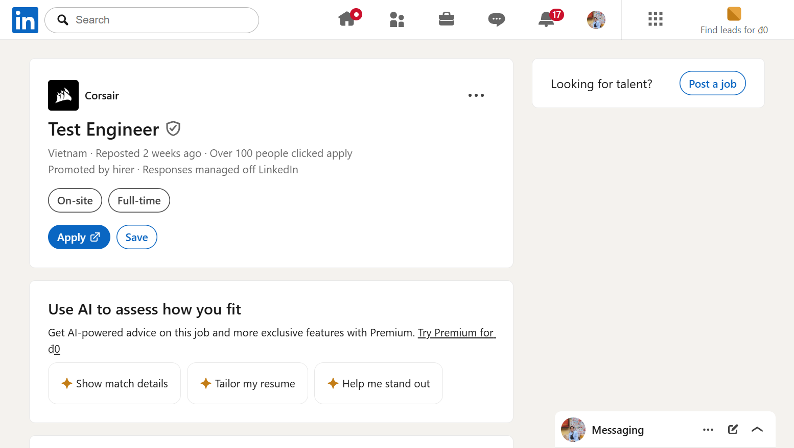
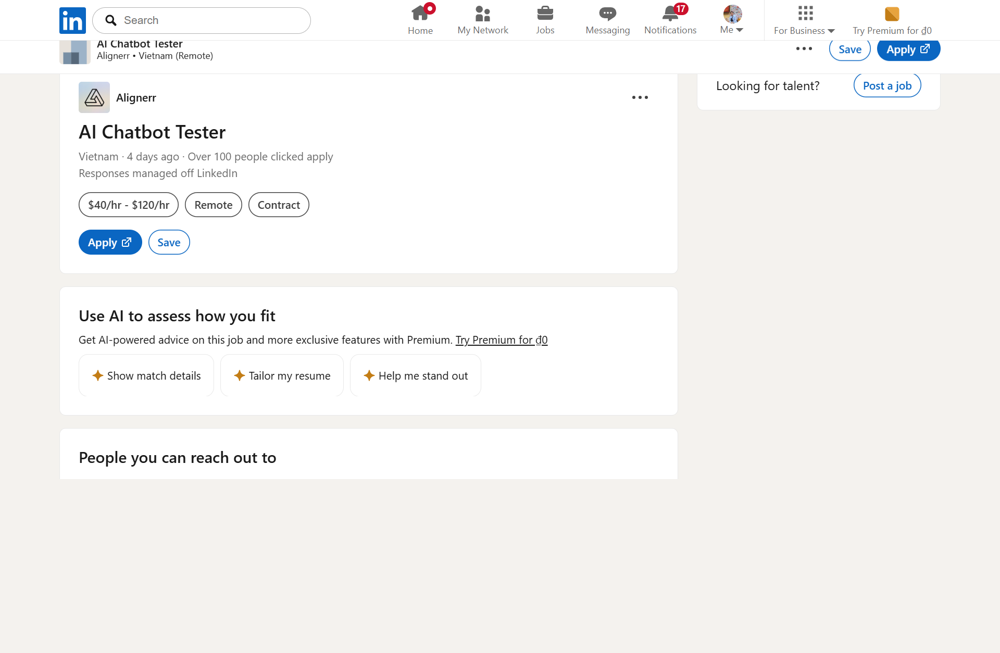
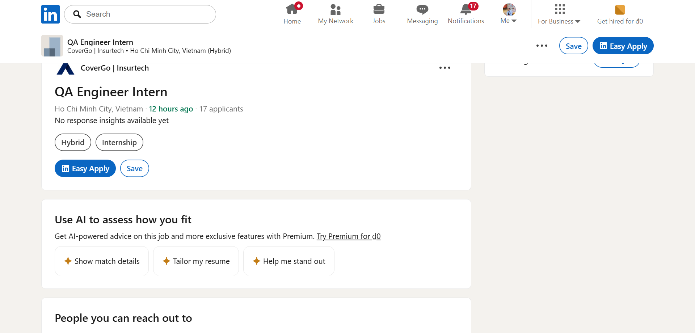
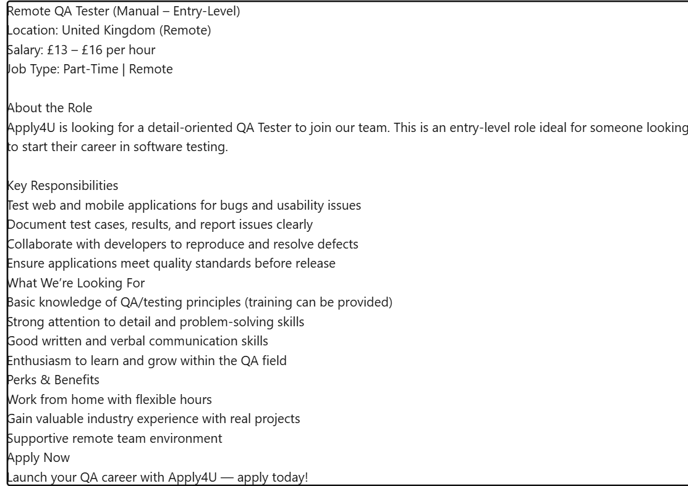
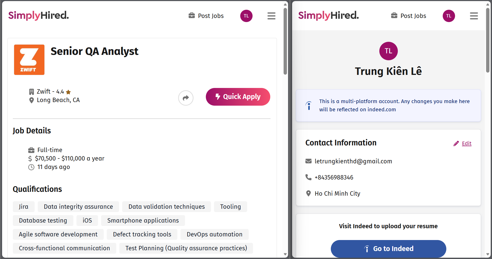
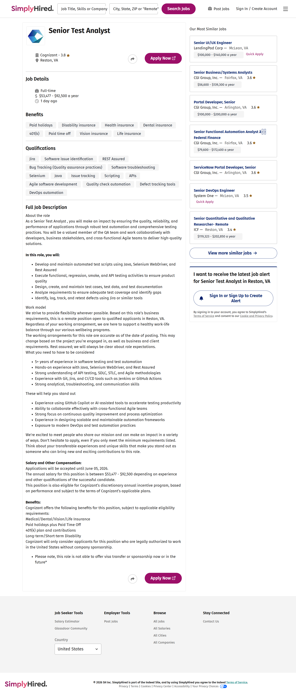
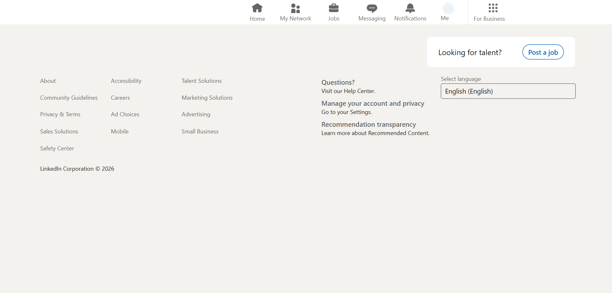
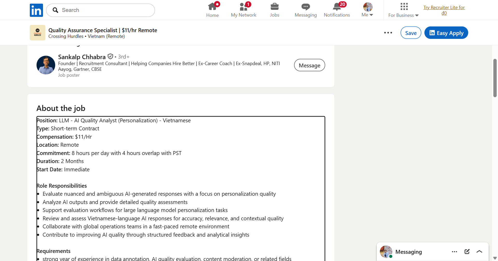
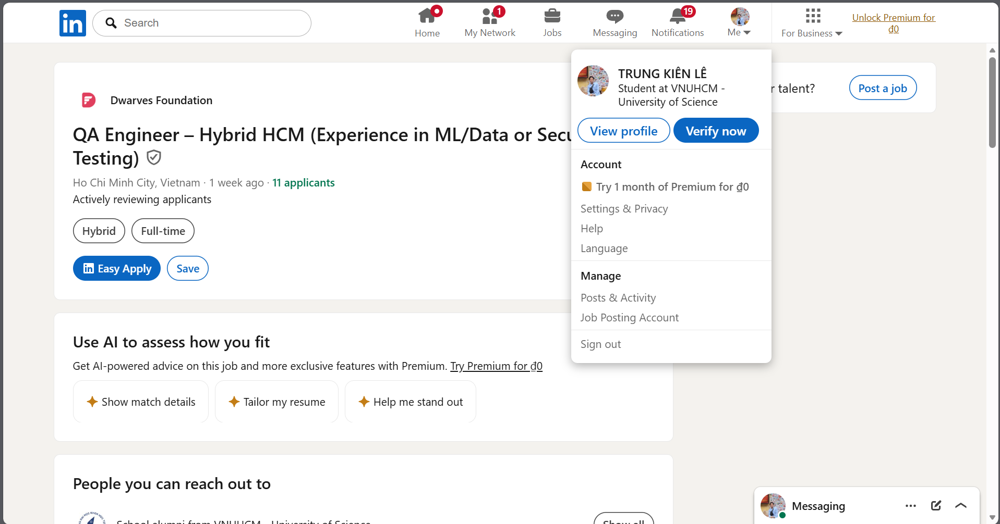
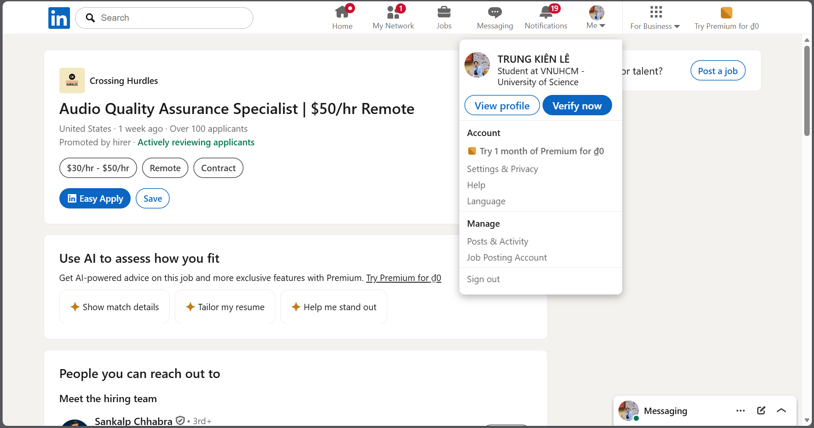

# HW01 Report — QA/QC Jobs · 20 Defects · Physical Product Testing

> StudentID: `23127075`  
> Student Name: `Lê Trung Kiên`  
> Course: Software Testing  
> Exercise: HW01  
> Submission Date: `04/06/2026`

---

## 1) Requirement 1 — QA/QC Job Market 2026+ (40 pts)

### 1.1 Summary
- Total postings collected: `10/10`
- Published within 60 days before submission: `Yes`
- Postings requiring AI/LLM/automation-AI skills: `8`

### 1.2 Job Postings

#### 1.2.1 Posting 01

- Job title: Business Analyst/Quality Assurance Analyst
- Company: Vion Consultants, Inc
- Location: Remote (primarily remote; occasional on-site in Baltimore, MD)
- Platform: SimplyHired
- Posting date: 01/06/2026
- Job URL: https://www.simplyhired.com/job/sZlt5OX6ynl8dQqiHuvfhuxrGj2L6sjsjSvNIQHIxLn0TRQetvLm8g
- Salary: From $40.00 an hour
- Requires AI/LLM/automation-AI skills? Y (manual + automation QA context)

**Job Description**

> **Full Job Description**
>
> Location: Primarily Remote (some on-site visit may be required in Baltimore, MD)
>
> Duration: 9 Months (possibility of extension)
>
> Candidate Location: Candidates within the DC/MD/VA metro area are preferred
>
> Job Summary
>
> We are seeking a dynamic and detail-oriented business analyst/quality assurance analyst to join our innovative technology team. In this role, you will be at the forefront of ensuring the quality and functionality of our software solutions, collaborating closely with developers, business analysts, and stakeholders. Your expertise will drive the development of robust test plans, execute comprehensive testing strategies, and facilitate seamless communication across teams to deliver high-quality products. If you thrive in a fast-paced environment and are passionate about software quality assurance and business analysis, this is your opportunity to make a meaningful impact.
>
> Responsibilities
> - Maintain requirements traceability across Strategic Brief, IA, and UX deliverables.
> - Document IA requirements and validate user-flow definitions.
> - Conduct stakeholder interviews and capture structured research outputs.
> - Track content workbook entries and validate retain/edit/remove dispositions.
> - Define mockup acceptance criteria and operate the defect log.
> - Trace UX Recommendations back to research and data points.
> - Serve as primary QA lead across testing, defect management, and pre-launch verification.
> - Author test plans and test cases for content edits, migration, redirects, and site testing.
> - Validate content edits across up to 500 high-priority pages.
> - Perform migration validation on a per-page basis.
> - Conduct WCAG 2.1 AA accessibility QA and remediation verification.
> - QA the redirect mapping for all 500 pages.
> - Manage hyper-care defect intake, prioritization, and triage.
>
> Required Qualification
> - Minimum 7 years of combined Business Analysis and QA experience.
> - Experience with content audits and content management workflows.
> - Strong manual testing experience with exposure to automated testing.
> - Proficient with defect tracking tools (Jira, Azure DevOps, or equivalent).
> - Demonstrated accessibility testing exposure.
>
> Preferred Qualifications
> - ISTQB or CSTE certification.
> - Drupal-based testing experience.
> - Experience validating migrated content at scale.
> - Hands-on experience with WCAG/Section 508 tooling (axe, WAVE, NVDA, JAWS).
>
> Pay: From $40.00 per hour
>
> Application Question(s)
> - Will you now or in the future require sponsorship to work in the US?
> - Do you have experience performing accessibility testing?
> - Do you have experience with Jira, Azure DevOps, or equivalent?
>
> License/Certification: ISTQB or CSTE certification (Preferred)
>
> Work Location: Hybrid remote in Baltimore, MD 21202

**Required Skills**

Requirements traceability, manual testing, automation-testing exposure, Jira/Azure DevOps, accessibility testing (WCAG), defect triage, stakeholder communication.

**AI Impact Analysis (1–2 sentences)**

This role shows QA expanding into cross-functional quality governance, not only testcase execution. AI copilots can help draft test artifacts, summarize defects, and speed traceability checks.

**Evidence**

---

#### 1.2.2 Posting 02

- Job title: AI Chatbot Tester
- Company: Alignerr
- Location: Vietnam (Remote)
- Platform: LinkedIn
- Posting date: 28/05/2026
- Job URL: https://www.linkedin.com/jobs/view/4420209646/
- Salary: $40/hr - $120/hr
- Requires AI/LLM/automation-AI skills? Y

**Job Description**

> **Full Job Description**
>
> About The Role
>
> What if your opinion could make AI smarter, safer, and more helpful for millions of people? As an AI Chatbot Tester with Alignerr, that's exactly what you'll do. We're looking for curious, thoughtful individuals to engage with cutting-edge AI chatbots, evaluate their responses, and provide the human feedback that drives real improvement in AI systems.
>
> This is a fully remote, flexible contract role — work on your own schedule, from anywhere.
>
> Organization: Alignerr  
> Type: Hourly Contract  
> Location: Remote  
> Commitment: 10–40 hours/week
>
> What You'll Do
> - Hold conversations with AI chatbots across a wide range of topics — from everyday questions to creative challenges.
> - Rate responses for helpfulness, accuracy, tone, and safety.
> - Identify issues such as factual errors, awkward phrasing, bias, or inappropriate outputs.
> - Push the limits of AI with creative, nuanced, and challenging prompts.
> - Record structured feedback that directly informs how AI systems are improved.
> - Work independently and asynchronously on your own schedule.
>
> Who You Are
> - Naturally curious — you enjoy exploring ideas across different topics and asking great questions.
> - Able to evaluate written responses critically and objectively.
> - Clear and concise in your written communication.
> - Comfortable navigating chat-based digital interfaces.
> - Reliable and self-motivated when working independently.
> - No technical background or prior AI experience required.
>
> Nice to Have
> - Experience in writing, editing, journalism, research, or customer service.
> - Familiarity with AI tools or chatbot platforms.
> - An eye for spotting subtle errors in logic, tone, or content.
>
> Why Join Us
> - Work on some of the most advanced AI projects in the world, partnering with top research labs.
> - Fully remote and flexible — set your own hours and work from anywhere.
> - Freelance autonomy: no micromanagement, no rigid schedules.
> - Meaningful work that directly shapes the quality and safety of AI used globally.
> - Potential for ongoing contracts and expanded project opportunities.

**Required Skills**

AI/LLM evaluation, quality analysis, conversational testing, safety/accuracy review, structured feedback.

**AI Impact Analysis (1–2 sentences)**

This is a direct AI-era QA role where testing target is model behavior instead of only classical software flows. Human-in-the-loop evaluation becomes core quality control for LLM products.

**Evidence**

---

#### 1.2.3 Posting 03

- Job title: Marketing QA Analyst
- Company: Mutual of Omaha
- Location: Remote
- Platform: SimplyHired
- Posting date: 10d
- Job URL: https://www.simplyhired.com/job/KddCc8sMwwLN4MqGnPHgyzWn7j4GU5OxO8IkaG0AF-HnpCDJBIIBLA
- Salary: $68,000 - $97,000 a year
- Requires AI/LLM/automation-AI skills? N
- Retrieval note: The original SimplyHired page was temporarily unavailable when revisited, so the full description below was copied from the official Mutual of Omaha careers page for the same role: https://www.mutualofomaha.com/careers/jobs/detail/504863

**Job Description**

> **Full Job Description**
>
> As our Marketing QA Analyst (or Sr. Analyst, depending on experience), you’ll partner closely with marketing, product, compliance, and operations teams to review, monitor, and maintain marketing materials across multiple channels. You’ll leverage compliance monitoring and workflow tools to support both automated and manual review processes while helping improve overall efficiency and governance.
>
> WHAT WE CAN OFFER YOU:
> - Estimated Salary (levels have variable responsibilities and qualifications):
> - Marketing QA Analyst (1-3 years experience): $68,000 - $87,500, plus annual bonus opportunity.
> - Sr. Marketing QA Analyst (4+ years experience): $75,500 - $97,000, plus annual bonus opportunity.
> - 401(k) plan with a 2% company contribution and 6% company match.
> - Work-life balance with vacation, personal time and paid holidays.
> - Applicants for this position must not now, nor at any point in the future, require sponsorship for employment.
>
> WHAT YOU'LL DO:
> - Review and monitor marketing materials for compliance with insurance regulations, brand standards, and product accuracy using both automated tools and manual review processes.
> - Communicate revisions and escalate flagged content for compliance review when needed.
> - Ensure the overall quality and accuracy of marketing assets, including spelling, grammar, formatting, print specifications, and metadata before materials are released to market.
> - Partner with marketing and project teams to ensure approved materials are market-ready, distributed on time, and maintained throughout their lifecycle, including tracking expirations and removing outdated assets.
> - Support audit readiness and governance efforts by maintaining clear documentation of reviews, approvals, and compliance activity while helping manage a centralized library of approved materials.
> - Identify opportunities to improve workflows, streamline review processes, and enhance efficiency through automation and process optimization.
>
> WHAT YOU’LL BRING:
> - A minimum of 1 year of experience in marketing, compliance, or marketing operations within the insurance or financial services industry.
> - Experience using compliance monitoring platforms such as PerformLine, Smarsh, Proofpoint, or Hearsay, along with a strong understanding of insurance marketing regulations and advertising review processes.
> - Strong attention to detail with the ability to review content for accuracy, consistency, and compliance while managing multiple priorities and deadlines in a fast-paced environment.
> - Experience working with digital asset management (DAM) systems and workflow management tools such as Adobe Workfront, JIRA, or Asana.
> - Excellent communication and collaboration skills with the ability to partner effectively across marketing, compliance, product, and operations teams.
> - Insurance or financial services marketing experience preferred, including familiarity with NAIC guidelines and state DOI requirements.
> - You promote a collaborative culture, value different ideas and opinions, and listen courageously, remaining curious in all that you do.
> - Able to work remotely with access to a high-speed internet connection and located in the United States or Puerto Rico.
> - We value unique experience, skills, and passion for innovation. If your experience aligns with the listed requirements, please apply.

**Required Skills**

Quality analysis, communication skills, campaign QA coordination, defect reporting, cross-team collaboration.

**AI Impact Analysis (1–2 sentences)**

Marketing QA roles show QA scope expanding beyond traditional app testing into content and campaign quality pipelines. AI can support faster anomaly detection and review prioritization.

**Evidence**

---

#### 1.2.4 Posting 04

- Job title: Remote QA Tester Work From Home
- Company: Apply4U | Human-Assisted AI Job & Recruitment Platform
- Location: United Kingdom (Remote)
- Platform: LinkedIn
- Posting date: 11 hours ago
- Job URL: https://www.linkedin.com/jobs/view/4421658202/
- Salary: £13/hr - £16/hr
- Requires AI/LLM/automation-AI skills? Y (AI-assisted platform context)

**Job Description**

> **Full Job Description**
>
> Remote QA Tester (Manual – Entry-Level)
>
> Location: United Kingdom (Remote)
>
> Salary: £13 – £16 per hour
>
> Job Type: Part-Time | Remote
>
> About the Role
>
> Apply4U is looking for a detail-oriented QA Tester to join our team. This is an entry-level role ideal for someone looking to start their career in software testing.
>
> Key Responsibilities
> - Test web and mobile applications for bugs and usability issues.
> - Document test cases, results, and report issues clearly.
> - Collaborate with developers to reproduce and resolve defects.
> - Ensure applications meet quality standards before release.
>
> What We’re Looking For
> - Basic knowledge of QA/testing principles (training can be provided).
> - Strong attention to detail and problem-solving skills.
> - Good written and verbal communication skills.
> - Enthusiasm to learn and grow within the QA field.
>
> Perks & Benefits
> - Work from home with flexible hours.
> - Gain valuable industry experience with real projects.
> - Supportive remote team environment.
>
> Apply Now: Launch your QA career with Apply4U — apply today.

**Required Skills**

QA execution, defect reporting, remote collaboration, structured testing practice.

**AI Impact Analysis (1–2 sentences)**

Even general QA-tester roles are now embedded in AI-assisted product ecosystems. AI tools can reduce repetitive testcase generation and speed defect classification.

**Evidence**

---

#### 1.2.5 Posting 05

- Job title: Senior QA Analyst
- Company: Zwift
- Location: Long Beach, CA (Remote-eligible US locations)
- Platform: SimplyHired
- Posting date: 9 days ago
- Job URL: https://www.simplyhired.com/job/Hna9XHBa_Kh_Knfugud6Qt2EPSUDnPF-XcQkBUodtpTum8fs5mCqxg
- Salary: $70,500 - $110,000 a year
- Requires AI/LLM/automation-AI skills? Y (automation/API/CI context)

**Job Description**

> **Full Job Description**
>
> Location: Remote- Eligible US Locations
>
> About the role and about You:
>
> Zwift seeks an experienced Sr. QA Analyst to join our team. As part of our QA Team, you will be responsible for ensuring test coverage across Zwift's family of software products. You will develop test plans, create test cases for new features and see our end-to-end testing through. You will help influence and acquire the methods, practices, and tools we'll use to drive how we test into the future.
>
> What you'll do:
> - Foster strong, communicative team spirit supporting our globally full-stack development efforts, supporting frontend and backend.
> - Collaborate with cross-functional teams, including developers, product managers, and designers, to create detailed test plans and test cases based on project requirements and specifications.
> - Define test strategy and lead testing from requirements gathering to release phase.
> - Organize and perform regression and feature testing to reveal bugs in software.
> - Craft detailed, reproducible, and concise bug reports.
> - Help design, refine, and distribute QA reports and feedback to development, product managers, customer support, and senior management.
> - Participate in technical design and provide a voice for testability and quality.
> - Continually improve test cases to ensure coverage on all Zwift software products.
> - Identify, source, define, and implement useful, specialized tools and/or methods to benefit process, automation, and reporting.
>
> What we're looking for:
> - 4+ years working in Quality Assurance focused on Mobile Application testing (iOS/Android), API testing, Server testing.
> - Experience in leading testing for client-server applications and native apps.
> - Strong analytical problem-solving skills.
> - 2+ years of recent experience using JIRA and TestMo to support Agile development teams.
> - Experience working in Agile/Scrum environments with cross-functional teams.
> - Ability to design and write effective test strategies for complex systems and features.
> - Deep understanding and experience in QA methodologies, tools, and practices.
> - Strong analytical and problem-solving skills with the ability to operate independently.
> - Database validation testing (SQL/NoSQL) to ensure data integrity and consistency.
> - Experience with CI/CD tools (Jenkins, GitHub Actions, GitLab CI) and test integration.
> - Bachelor's Degree in Computer Science or a related technical field, or equivalent demonstrable experience and ability.
>
> Bonus points:
> - Experience using test tools such as Appium, Postman, and JavaScript.
> - Experience in testing microservices.
> - Passion for cycling, running and/or fitness.
> - Passion for video games and web technologies.
> - Experienced Zwifter.
>
> For All US Based Full-Time Positions:
> - The base salary for this position ranges between $70,500 to $110,000 depending on role, experience, qualifications, and geographic location.
> - In addition to base salary, Zwift offers performance bonuses, equity, and a comprehensive benefits package.
>
> If Zwift determines in any stage of our interviews that any AI tools are being used without disclosure or citation, your candidacy will be disqualified.

**Required Skills**

Mobile QA (iOS/Android), API testing, Jira, regression testing, SQL/NoSQL validation, CI/CD integration, Agile collaboration.

**AI Impact Analysis (1–2 sentences)**

Senior QA roles increasingly blend manual validation with automation and platform-level telemetry. AI copilots can speed root-cause analysis and reduce repetitive regression effort.

**Evidence**

---

#### 1.2.6 Posting 06

- Job title: Senior Test Analyst
- Company: Cognizant
- Location: Reston, VA (Remote)
- Platform: SimplyHired
- Posting date: 13 hours ago
- Job URL: https://www.simplyhired.com/job/Z384WERQ3uUYT3LmAcdqMvq7be7xD7HcPE8ILoBK1d45P_UUycFjSw
- Salary: $53,477 - $92,500 a year
- Requires AI/LLM/automation-AI skills? Y (automation/API testing)

**Job Description**

> **Full Job Description**
>
> About the role
>
> As a Senior Test Analyst, you will make an impact by ensuring the quality, reliability, and performance of applications through robust test automation and comprehensive testing practices. You will be a valued member of the QA team and work collaboratively with developers, business stakeholders, and cross-functional Agile teams to deliver high-quality solutions.
>
> In this role, you will:
> - Develop and maintain automated test scripts using Java, Selenium WebDriver, and Rest Assured.
> - Execute functional, regression, smoke, and API testing activities to ensure product quality.
> - Design, create, and maintain test cases, test data, and test documentation.
> - Analyze requirements to ensure adequate test coverage and identify gaps.
> - Identify, log, track, and retest defects using Jira or similar tools.
>
> Work model
>
> We strive to provide flexibility wherever possible. Based on this role’s business requirements, this is a remote position open to qualified applicants in Reston, VA. Regardless of your working arrangement, we are here to support a healthy work-life balance through our various wellbeing programs.
>
> The working arrangements for this role are accurate as of the date of posting. This may change based on the project you’re engaged in, as well as business and client requirements.
>
> What you need to have to be considered
> - 5+ years of experience in software testing and test automation.
> - Hands-on experience with Java, Selenium WebDriver, and Rest Assured.
> - Strong understanding of API testing, SDLC, STLC, and Agile methodologies.
> - Experience with Git, Jira, and CI/CD tools such as Jenkins or GitHub Actions.
> - Strong analytical, troubleshooting, and communication skills.
>
> These will help you stand out
> - Experience using GitHub Copilot or AI-assisted tools to accelerate testing productivity.
> - Ability to collaborate effectively with cross-functional Agile teams.
> - Strong focus on continuous quality improvement and process optimization.
> - Experience in designing scalable and maintainable automation frameworks.
> - Exposure to modern DevOps and test automation practices.
>
> Salary and Other Compensation
> - Applications will be accepted until June 05, 2026.
> - The annual salary for this position is between $53,477 - $92,500 depending on experience and qualifications.
> - This position is also eligible for Cognizant’s discretionary annual incentive program.
>
> Benefits
> - Medical/Dental/Vision/Life Insurance.
> - Paid holidays plus Paid Time Off.
> - 401(k) plan and contributions.
> - Long-term/Short-term Disability.
>
> Cognizant will only consider applicants for this position who are legally authorized to work in the United States without company sponsorship.

**Required Skills**

Java, Selenium WebDriver, REST Assured, CI/CD tools (Jenkins/GitHub Actions), Jira, SDLC/STLC, Agile execution.

**AI Impact Analysis (1–2 sentences)**

This role highlights enterprise demand for automation-first QA with API depth and CI discipline. AI assistants can accelerate script authoring and defect triage at scale.

**Evidence**

---

#### 1.2.7 Posting 07

- Job title: Clinical Quality Assurance Analyst
- Company: Themesoft Inc
- Location: Albany, NY (Remote)
- Platform: SimplyHired
- Posting date: 12d
- Job URL: https://www.simplyhired.com/job/ptTM58YVddK9WzZn6iqn01UByaalq4gjIXIW73GUMQDNUcEXbxgNUg
- Salary: $50 - $55 an hour
- Requires AI/LLM/automation-AI skills? N

**Job Description**

> **Full Job Description**
>
> Job Title: Clinical Quality Assurance Analyst
>
> Location: Albany - Remote with travel
> - Travel may be required up to 25% of the time.
> - Some overnight stays will be required, sometimes for the entire work week.
> - An expense budget will be available for travel costs.
> - Expense invoices will be due within 7 days of travel.
> - Remote work will be allowed when not traveling.
>
> Key Responsibilities:
> - Evaluate child/youth’s records for compliance to applicable regulations.
> - Clearly communicate evaluation requirements and follow up.
> - Evaluate documentation against applicable State/Federal regulations.
> - Collect data and documentation to support compliance findings.
> - Utilize technology to convert hard copy documentation to electronic and submit via secure file transfer.
> - Record, summarize, and communicate compliance findings for the Children’s Transformation Program.
> - Assist in determining trends in non-compliance.
> - Make appropriate and timely recommendations to project management.
> - Assist with the ongoing operationalization of project processes and procedures.
> - Assist with all internal and external reporting.
> - Build and maintain relationships with stakeholders to provide a high level of customer service.
> - Traveling to provider sites to perform case reviews.
>
> Required Qualifications:
> - Bachelor’s degree in public health, healthcare management, psychology, human services, or related field.
> - A minimum of 2 years of experience as a Healthcare Compliance Analyst, Auditor, Care Manager, or Medicaid Provider, in a role responsible for conducting oversight, compliance audits or chart reviews, or ensuring quality of care.
> - An equivalent combination of advanced education, training, and experience will be considered.
> - Experience with Medicaid fee-for-service and/or Managed Care billing.
> - Proficiency in MS Excel, MS Word, MS Outlook, MS Visio, MS PowerPoint and MS SharePoint.
> - Strong analytical and problem-solving abilities; able to evaluate data and make sound, evidence-based decisions.
>
> Preferred/Desired Qualifications:
> - Extensive knowledge of, and experience with, Home and Community-Based Services (HCBS) Waiver programs, including the 1915(c) NYS Children’s Waiver, either as a provider or compliance officer.
> - Experience working with eMedNY, CANS-NY, UAS-NY, Medicaid Health Homes, Medicaid Managed Care Organizations (MMCOs), or other related programs/systems.
> - Experience with NYS Medicaid billing, including the use of various Electronic Health Records (EHR) systems.
> - Experience working with Office of Mental Health (OMH), Office for People with Developmental Disabilities (OPWDD), or Office of Children and Families (OCFS).
> - Ability to manage time independently while meeting deadlines and adhering to high performance standards.
> - Experience with compliance audits or chart reviews.
> - Ability to work with and relate to staff and demonstrate active listening skills.
> - Process oriented and results-driven work strategy.
> - Ability to foster teamwork with all levels of management and staff.
> - Ability to work well independently and within a team.
> - Exceptional customer service relationship techniques, including superior verbal and written communication skills.
> - Excellent accuracy and attention to detail.

**Required Skills**

Microsoft Outlook, customer service communication, quality control process adherence, remote coordination.

**AI Impact Analysis (1–2 sentences)**

Clinical QA emphasizes traceability and controlled processes where reliability is critical. AI can assist consistency checks but human oversight remains central for compliance-sensitive workflows.

**Evidence**

---

#### 1.2.8 Posting 08

- Job title: Quality Assurance Specialist | $11/hr Remote
- Company: Crossing Hurdles
- Location: Vietnam (Remote)
- Platform: LinkedIn
- Posting date: within 60-day window (promoted/current listing)
- Job URL: https://www.linkedin.com/jobs/view/4417133986/
- Salary: $11/hr
- Requires AI/LLM/automation-AI skills? Y

**Job Description**

> **Full Job Description**
>
> Position: LLM - AI Quality Analyst (Personalization) - Vietnamese
>
> Type: Short-term Contract  
> Compensation: $11/Hr  
> Location: Remote  
> Commitment: 8 hours per day with 4 hours overlap with PST  
> Duration: 2 Months  
> Start Date: Immediate
>
> Role Responsibilities
> - Evaluate nuanced and ambiguous AI-generated responses with a focus on personalization quality.
> - Analyze AI outputs and provide detailed quality assessments.
> - Support evaluation workflows for large language model personalization tasks.
> - Review and assess Vietnamese-language AI responses for accuracy, relevance, and contextual quality.
> - Collaborate with global operations teams in a fast-paced remote environment.
> - Contribute to improving AI quality through structured feedback and analytical insights.
>
> Requirements
> - Strong experience in data annotation, AI quality evaluation, content moderation, or related fields.
> - BS/BA degree or equivalent experience in Policy, Law, Ethics, Linguistics, Journalism, Computer Science, or related analytical fields.
> - Vietnamese proficiency with strong reading and writing comprehension skills.
> - Exceptional analytical thinking and ability to assess nuanced AI responses.
> - Willingness to use a primary personal Google account and enable personal data sources for genuine assessment tasks.
> - Full-time availability in local time zone with 4 hours overlap with PST.
> - Excellent communication and collaboration skills in remote work environments.
>
> Application Process
> - Apply/Easy Apply and check email for application form.
> - Fill Google form.
> - Complete the assessment link after shortlisting within 24 hours.

**Required Skills**

Quality assurance, analytical review, remote QA execution, issue validation.

**AI Impact Analysis (1–2 sentences)**

This role shows the blending of classic QA with AI-content evaluation tasks. Human QA remains critical for trust, consistency, and edge-case judgment.

**Evidence**

---

#### 1.2.9 Posting 09

- Job title: Quality Assurance Specialist (Vietnamese) | $11/hr - Remote
- Company: Crossing Hurdles
- Location: Vietnam (Remote)
- Platform: LinkedIn
- Posting date: within 60-day window (promoted/current listing)
- Job URL: https://www.linkedin.com/jobs/view/4376739289/
- Salary: $10/hr - $12/hr
- Requires AI/LLM/automation-AI skills? Y

**Job Description**

> **Full Job Description**
>
> Position: LLM – AI Quality Analyst (Personalization) – Vietnamese
>
> Type: Short-Term Contract  
> Location: Remote  
> Commitment: 30–40 hours/week, 4-hour overlap with PST  
> Engagement Length: 2 months  
> Start Date: Immediate
>
> Role Responsibilities
> - Design multi-turn conversational prompts (1–5 turns) using personal context.
> - Evaluate personalized AI responses for grounding, integration, and helpfulness.
> - Assess correct usage of personal data and identify flawed inferences or hallucinations.
> - Review integration quality to ensure personalization feels natural and not over-narrated.
> - Conduct side-by-side (SxS) evaluation and ranking of model responses.
> - Identify personalization errors, reasoning gaps, and grounding issues.
> - Write clear, structured rationales referencing specific conversation turns.
> - Extract and verify “Debug Info” to confirm correct data source utilization.
> - Maintain strict data hygiene by deleting evaluation conversations.
>
> Requirements
> - Vietnamese proficiency (reading and writing).
> - Strong experience in data annotation, AI quality evaluation, content moderation, or related roles.
> - Strong analytical skills for evaluating nuanced and ambiguous AI outputs.
> - Experience with creative prompt engineering and multi-turn conversations.
> - Understanding of personalization concepts and AI response evaluation.
> - High attention to detail for SxS comparisons.
> - Excellent written communication and feedback documentation skills.
> - BS/BA degree or equivalent experience in a relevant field.
> - Willingness to use a primary personal Google account with enabled personal data sources.
> - Self-motivated and able to work independently in a remote setup.
> - Desktop/laptop with reliable internet connection.
>
> Application Process
> - Fill out the application form.
> - Complete the ICF.
> - Complete the assessment.

**Required Skills**

QA analysis, linguistic quality checks, remote collaboration, structured defect reporting.

**AI Impact Analysis (1–2 sentences)**

Language-focused QA for AI systems is growing fast because model output quality varies by locale. Human evaluators provide nuance that automated checks still miss.

**Evidence**

---

#### 1.2.10 Posting 10

- Job title: Audio Quality Assurance Specialist | $50/hr Remote
- Company: Crossing Hurdles
- Location: United States (Remote)
- Platform: LinkedIn
- Posting date: 1 week ago
- Job URL: https://www.linkedin.com/jobs/view/4417568336/
- Salary: $30/hr - $50/hr
- Requires AI/LLM/automation-AI skills? Y

**Job Description**

> **Full Job Description**
>
> Position: Audio Engineer
>
> Type: Contract  
> Compensation: $30 - $50/hour  
> Location: Remote  
> Commitment: 10-40 hrs/week
>
> Role Responsibilities
> - Conduct detailed quality assurance on audio recordings by identifying and documenting artifacts or anomalies.
> - Assess the severity of audio issues and classify them accurately for AI model training use.
> - Perform audio cleanup and restoration tasks to ensure data meets professional standards.
> - Annotate audio and video data with clear, concise notes to support AI/ML development.
> - Participate in labeling, review, and quality control processes for large-scale datasets.
> - Collaborate effectively with a distributed team, providing regular feedback and contributing to a culture of high standards.
>
> Requirements
> - Have a professional monitoring setup, including studio monitors or high-end headphones, suitable for critical listening tasks.
> - Possess a strong command of written and verbal English communication for precise issue reporting and team collaboration.
> - Have a deep understanding of audio quality assurance processes and artifact detection methodologies.
> - Have experience with audio restoration, cleanup, and editing workflows using industry-standard tools.
> - Be self-motivated, detail-oriented, and comfortable working independently in a remote environment.
>
> Application Process
> - Easy Apply on LinkedIn.
> - Check email for next steps.
> - Participate in resume evaluation and interview stage.

**Required Skills**

Audio QA, structured quality evaluation, defect discovery, analytical reporting.

**AI Impact Analysis (1–2 sentences)**

Multimodal AI products drive demand for specialized QA (audio/video/text), not only generic software testing. This role indicates QA specialization trend in AI-era job market.

**Evidence**

---

## 2) Requirement 2 — 20 Software Defects (2022–2026) (20 pts)

### 2.1 Summary
- Total defects: `20/20`
- AI/LLM-related defects: `<count>` (must be `>= 5`)
- AI bias/hallucination analysis entries: `20/20` (one per defect)

### 2.2 Defects Table

> Paste from `hw01-software-defects-table-template.md`

---

## 3) Requirement 3 — Test Cases for ONE Physical Product (40 pts)

### 3.1 Device Declaration
- Device type: Domestic fan with physical speed buttons and rotational louver knob
- Brand: Lifan
- Model: `<not specified>`
- Year: `<not specified>`
- Serial number (masked middle 4 chars): `<not available>`

### 3.2 Required Device Evidence
- Device photo + student ID in same frame: `<file path>`

### 3.3 Test Cases (15 total)

| TC ID | Objective | Input / Preconditions | Steps | Expected Result | Actual Result | Verdict (Pass/Fail) | Edge Case? (Y/N) | AI Generated? (Y/N) | Notes |
|---|---|---|---|---|---|---|---|---|---|
| TC-01 | Verify Stop button turns fan off | Fan plugged in. Button 1, 2, or 3 is active. | 1. Turn fan on at any speed. 2. Press button 0. 3. Observe blades and airflow. | Fan motor stops. No airflow. Speed button 0 remains selected. |  |  | N | Y | Functional |
| TC-02 | Verify Low speed button works | Fan plugged in. Fan is stopped. | 1. Press button 1. 2. Observe blade movement and airflow. | Fan starts at low speed. Airflow is weak but stable. No abnormal noise. |  |  | N | Y | Functional |
| TC-03 | Verify Medium speed button works | Fan plugged in. Fan is stopped. | 1. Press button 2. 2. Observe blade movement and airflow. | Fan starts at medium speed. Airflow is stronger than Low. No abnormal noise. |  |  | N | Y | Functional |
| TC-04 | Verify High speed button works | Fan plugged in. Fan is stopped. | 1. Press button 3. 2. Observe blade movement and airflow. | Fan starts at high speed. Airflow is strongest. Fan remains stable. |  |  | N | Y | Functional / Safety |
| TC-05 | Verify speed changes from Low to Medium to High | Fan plugged in. Fan is stopped. | 1. Press button 1. 2. Press button 2. 3. Press button 3. 4. Compare airflow after each press. | Fan changes speed according to selected button. Airflow increases from Low to Medium to High. |  |  | N | Y | Functional |
| TC-06 | Verify speed changes from High to Medium to Low | Fan plugged in. Fan running at High speed. | 1. Press button 2. 2. Press button 1. 3. Observe airflow and noise. | Fan decreases speed correctly. No sudden stop, vibration, or abnormal sound. |  |  | N | Y | Functional |
| TC-07 | Verify pressing Stop while fan is at High speed | Fan plugged in. Fan running at High speed. | 1. Press button 3. 2. Wait until stable. 3. Press button 0. 4. Observe stopping behavior. | Fan stops safely. Blades slow down normally. No spark, burning smell, or sudden mechanical issue. |  |  | Y | Y | Physical safety edge case |
| TC-08 | Verify only one speed button can stay selected | Fan plugged in. | 1. Press button 1. 2. Press button 2. 3. Press button 3. 4. Check physical button states. | Only the last selected speed button remains active. Previous button releases or becomes inactive. |  |  | N | Y | Usability / Functional |
| TC-09 | Verify rotational louver knob turns wind direction rotation on | Fan plugged in. Fan running at Low/Medium/High speed. | 1. Press button 2. 2. Turn center knob to rotation ON position. 3. Observe front louver movement. | Rotational louver starts rotating. Wind direction changes smoothly. |  |  | N | Y | Functional |
| TC-10 | Verify rotational louver knob turns wind direction rotation off | Fan plugged in. Fan running. Louver rotation is ON. | 1. Turn center knob to OFF position. 2. Observe louver movement. | Rotational louver stops rotating. Fan continues blowing at selected speed. |  |  | N | Y | Functional |
| TC-11 | Verify louver rotation speed adjustment by knob | Fan plugged in. Fan running. Knob supports adjustable rotation speed. | 1. Turn knob slowly from low rotation setting to higher setting. 2. Observe louver rotation speed. | Louver rotation speed changes according to knob position. Movement remains smooth. |  |  | N | Y | Functional / Usability |
| TC-12 | Verify louver knob behavior when fan speed is 0 | Fan plugged in. Speed button 0 selected. | 1. Press button 0. 2. Turn louver knob ON. 3. Observe fan blades and louver. | Fan blades stay stopped. Louver should not rotate if main motor power is off, or should behave according to product design without unsafe movement. |  |  | Y | Y | Edge case: knob ON while fan stopped |
| TC-13 | Verify buttons are easy to press and labels are understandable | Fan placed on normal use surface. | 1. Inspect button labels 0, 1, 2, 3. 2. Press each button once. 3. Observe tactile feedback. | Labels are visible and understandable. Buttons are not too hard to press. User can identify Stop/Low/Medium/High easily. |  |  | N | Y | Usability |
| TC-14 | Verify fan remains physically stable at High speed with louver rotation ON | Fan plugged in. Placed on flat surface. | 1. Press button 3. 2. Turn louver knob ON/high rotation. 3. Observe fan body for 1 minute. | Fan does not shake excessively, fall, or move from position. No unsafe vibration. |  |  | Y | Y | Physical safety edge case |
| TC-15 | Verify front case/grill prevents finger contact with moving blades | Fan plugged in. Fan running at Low speed. Use safe non-body object only. | 1. Visually inspect front grill spacing. 2. Use a thin safe test object near grill without forcing it. 3. Do not insert fingers. | Grill prevents accidental contact with moving blades during normal use. No sharp edges on front case. |  |  | Y | Y | Physical safety. Do not use fingers. |

### 3.4 Test Execution Video Log (>=5)

> Paste from `hw01-test-execution-video-log-template.md`

### 3.5 Device Defect Log (target >=5)

> Paste from `hw01-device-defect-issue-log-template.md`

### 3.6 AI-missed Edge Cases (>=3 mandatory)
For each edge case AI missed, provide:
1. AI conversation screenshot proving AI did not generate it
2. Why AI likely missed it
3. Why it is critical for real-device QA

| Edge Case ID | Test Case ID | AI Conversation Evidence | Why AI Missed It | Why It Matters |
|---|---|---|---|---|
| EC-01 | TC-__ | `<link/screenshot>` | `<reason>` | `<impact>` |
| EC-02 | TC-__ | `<link/screenshot>` | `<reason>` | `<impact>` |
| EC-03 | TC-__ | `<link/screenshot>` | `<reason>` | `<impact>` |

---

## 4) CLO Mapping (G9.1, G9.3)

### G9.1 — Understand
- Prompt AI tool for ISTQB-process mindmap
- Find and correct at least 3 mistakes
- Evidence file(s): `<path>`

### G9.3 — Analyse
- Analyse AI-generated output and identify missing edge cases
- Evidence in Requirement 3.6

---

## 5) AI Critique (200–300 words, mandatory)

> Write 200–300 words:
- Where AI was wrong / biased / incomplete
- Why AI failed
- Principles learned for collaborating with AI in this HW

`<write your 200–300 words here>`

---

## 6) Mandatory Disclosure (mandatory)

Use this exact block and edit placeholders:

> "[Test cases / script / dataset / report] was initially generated by [AI tool name]; I reviewed and modified [section X], added [edge cases Y, Z]; [section W] was written entirely by me. The detailed AI Audit Report is attached as Appendix A. I confirm I did not use AI to generate any artifact listed in the prohibited category below."

---

## 7) Anti-Cheat Evidence Checklist

- [ ] Device photo with student-ID in same frame
- [ ] Execution videos contain your own voice narration
- [ ] All 10 job posting screenshots show your logged-in account/display name
- [ ] Prompt log `.md` with timestamps for every AI prompt

---

## 8) Self-Assessment (mandatory)

> Paste from `hw01-self-assessment-template.md`

---

## 9) Appendix A — AI Audit Report

> Paste entries from `ai-02-ai-audit-report-template.md`

## 10) Appendix B — Prompt Log

> Paste from `hw01-prompt-log-template.md`

## 11) Appendix C — AI Disclosure Form

> Paste from `ai-03-ai-disclosure-form-template.md`

## 12) Appendix D — AI Privacy & Responsible Use Checklist

> Paste from `ai-05-ai-privacy-responsible-use-checklist-template.md`
